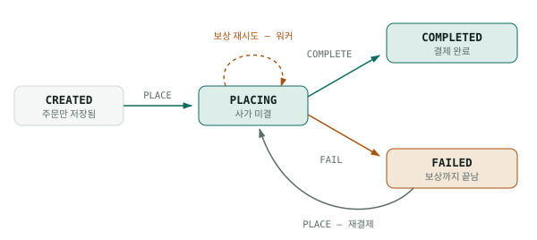
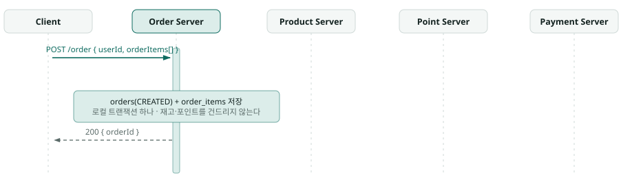
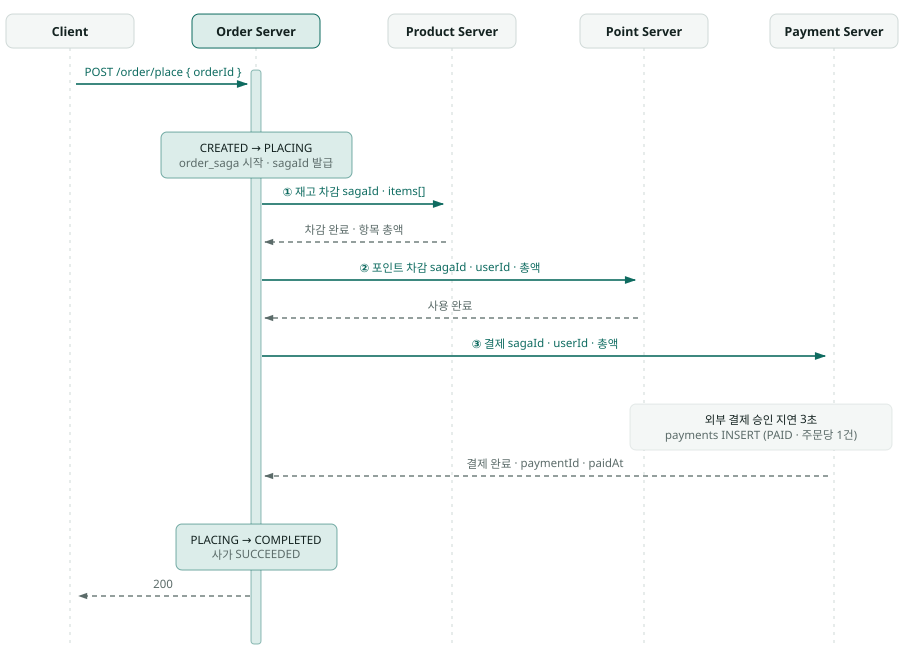
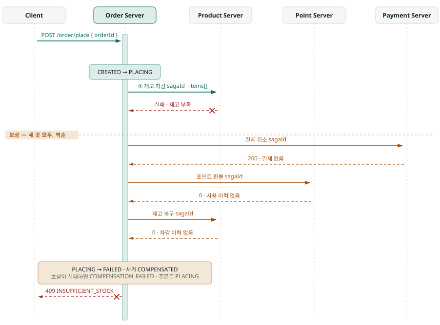
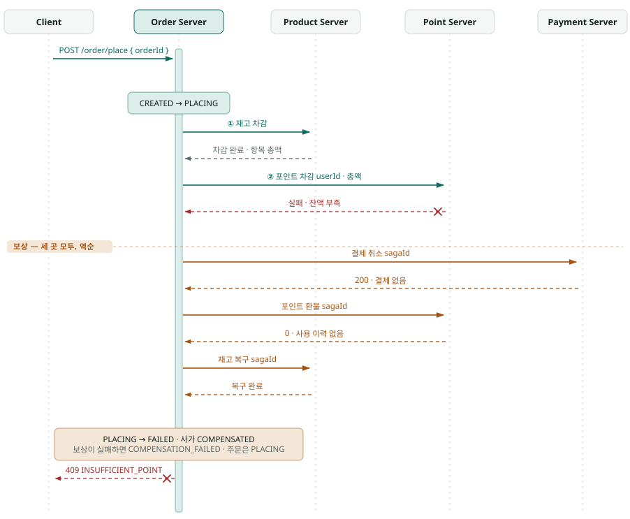
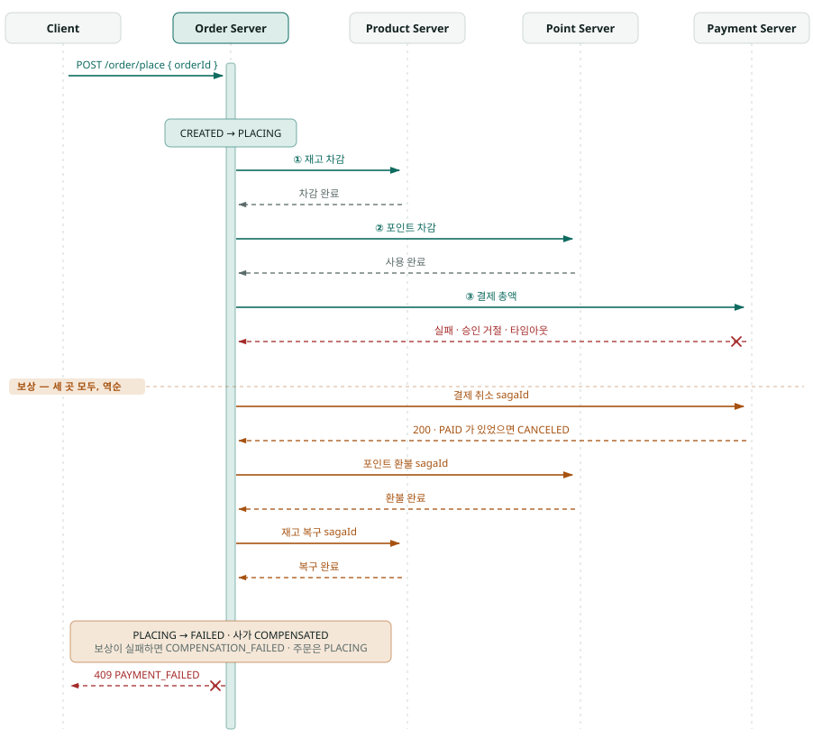

# ADR-0002 — Saga(Orchestration) 설계 결정

- **상태**: 승인.
- **날짜**: 2026-09-22
- **요구사항 정본**: `docs/0001_project_requirements_document.md`
- **파생 문서**: `docs/0003_sync_http_architecture.md`(A안). B안은 보류했고 문서는 착수할 때 쓴다.

## 0. 지금 상태

- 이 문서와 `docs/0003`의 결정은 구현이 끝났다.
- `order`(8080) · `point`(8081) · `product`(8082) · `payment`(8083) 네 서비스와 라이브러리 `common`으로 분리했고, MySQL 한 인스턴스에 스키마 네 개를 서비스별 계정으로 나눠 쓴다.
- 아래 §1이 말하는 "현행 모놀리스"는 이 결정을 내리던 시점의 상태다.
- `docs/0001`(PRD) §1의 Phase 서술도 착수 전 기준이라 지금 구조와 다르다. 현재 구조와 결정은 `docs/0003`이 갖는다.

## 1. 맥락

- 주문 결제(`POST /order/place`)는 재고와 포인트와 주문 상태를 한꺼번에 바꾼다.
- 현행 모놀리스는 이것을 한 DB, 한 `@Transactional`로 처리하고, 동시성은 MySQL 행 락이 맡으며 잠금 순서는 orders → products(productId 오름차순) → points로 고정이다.
- 문맥을 서비스로 분리하고 DB를 나눠 가지면 이 두 수단이 함께 사라진다.
- 그래도 지켜야 할 것은 그대로다.
    - **원자성** — 한 단계라도 실패하면 재고·포인트·주문 상태가 전부 결제 전으로 돌아간다. 지금은 한 `@Transactional`이 보장한다.
    - **멱등성** — 같은 주문으로 몇 번 요청해도 차감은 한 번이다. 지금은 `COMPLETED`면 즉시 반환해 보장한다.
    - **동시성** — 같은 주문에 동시 요청이 와도 차감은 한 번이다. 지금은 주문 행 락(NOWAIT)이 보장한다.
    - **실패 응답** — HTTP 상태와 `{code, message}`로 구분하고 클라이언트는 `code`로 분기한다.
- 분산 트랜잭션을 Saga(Orchestration)로 처리하는 것은 전제다. 이 문서는 그 안에서 갈린 결정과 각각의 트레이드오프를 기록한다.

### 서비스 분해

- 문맥이 그대로 서비스 경계가 되고 서비스마다 자기 DB를 가지므로, 문맥 간 조인도 문맥을 가로지르는 행 락도 더 이상 없다.
- **Order**(오케스트레이터)는 `orders`·`order_items`·`order_saga`를 갖고 주문 생성과 주문 결제를 제공하며, 보상 오퍼레이션이 없는 대신 자기 상태를 직접 되돌린다.
- **Product**는 `products`와 `product_transaction_histories`를 갖고 재고 차감(`buy`)과 재고 복구(`restore`)를 제공한다.
- **Point**는 `points`와 `point_transaction_histories`를 갖고 포인트 사용(`use`)과 포인트 환불(`refund`)을 제공한다.
- **Payment**는 `payments`를 갖고 결제와 결제 취소를 제공한다.
- 보상 오퍼레이션은 사가 전용이라 외부 클라이언트에 공개하지 않는다. `refund`는 포인트 충전 API가 아니고 `restore`는 상품 입고 API가 아니다.

## 2. 결정 요약

- **결정 1** — 오케스트레이터는 Order 서비스가 겸한다. 전용 오케스트레이터 서비스는 두지 않는다.
- **결정 2** — 단계 순서는 재고 → 포인트 → 결제다. 결제를 먼저 두거나 Payment가 Point를 부르는 중첩 구조는 버렸다.
- **결정 3** — 보상은 결제 → 포인트 → 재고의 역순으로 세 곳 모두에 보낸다. 정방향 순서, 성공한 단계만 고르기, 응답값 추론은 버렸다.
- **결정 4** — 보상 근거는 참여자의 거래 이력 테이블에 둔다. 오케스트레이터가 payload를 들고 있지 않다.
- **결정 5** — 멱등 키는 `sagaId`다. `orderId`를 멱등 키로 쓰지 않는다.
- **결정 6** — 동시성은 주문 상태(`PLACING`)로 막는다. 분산 락도, 참여자 락에만 기대는 것도 버렸다.
- **결정 7** — 주문 상태에 `PLACING`과 `FAILED`를 더한다. 두 값을 유지하거나 보상 실패를 `FAILED`로 닫는 것은 버렸다.
- **결정 8** — 통신은 A안(동기 HTTP + 보상 워커)을 먼저 하고 그다음 B안으로 간다. 처음부터 비동기 메시지로 가지 않는다.

## 3. 결정 1 — 오케스트레이터를 어디에 두나

- **Order 서비스가 겸한다.**
- 얻는 것은 서비스가 늘지 않는다는 점과, 사가 상태와 주문 상태를 한 로컬 트랜잭션으로 커밋할 수 있다는 점이다.
- 잃는 것은 Order가 주문 도메인과 지휘자 두 역할을 겸한다는 점이다.
- 전용 오케스트레이터 서비스를 두면 지휘 책임이 분리되고 다른 사가가 생겨도 재사용되지만, 사가 상태와 주문 상태가 다른 DB로 갈려 그 사이에 또 하나의 분산 트랜잭션이 생긴다.
- 이 둘이 갈리면 해결하려던 문제가 한 층 더 생기므로 한 커밋으로 묶을 수 있다는 점이 결정적이었다. 사가가 주문 결제 하나뿐이라 재사용 이득도 지금은 없다.

## 4. 결정 2 — 단계 순서

- **재고 → 포인트 → 결제 순서로 간다.**
- 가장 느리고 되돌리기 번거로운 단계가 맨 뒤라, 앞에서 실패하면 결제를 시작조차 하지 않는다. 대신 결제 실패 시 되돌릴 것이 둘로 가장 많다.
- 결제를 먼저 두면 결제 건이 먼저 생겨 추적이 쉽지만, 결제가 `PENDING`과 `PAID` 두 단계로 쪼개져 Payment가 흐름에 두 번 등장하고, 3초를 가장 먼저 치르므로 뒤에서 재고가 부족해도 이미 기다린 뒤다.
- Payment가 내부에서 Point를 부르면 현행 `PaymentService.pay` 구조를 그대로 옮길 수 있지만, 보상 주체가 둘로 갈려 중첩 사가가 된다.
- 재고 부족과 잔액 부족은 자주 나는 실패라 앞에 두면 3초를 치르기 전에 걸러진다.
- 세 번째 안을 버린 것은 보상 책임을 오케스트레이터 한곳에 두기 위해서이고, 그 대가로 **결제는 포인트 차감을 더 이상 포함하지 않는다**.

## 5. 결정 3 — 보상 순서

- **정방향의 역순(결제 → 포인트 → 재고)으로 돌고, 어느 단계에서 실패했든 세 곳 모두에 보낸다.**
- 역순으로 돌면 다른 주문이 곧바로 쓸 수 있는 포인트가 먼저 풀리고, 재고 복구가 실패해도 포인트는 이미 돌아가 있다.
- 성공한 단계만 골라 보내면 헛호출이 없지만, 원격 호출 성공과 `order_saga` 커밋 사이에 프로세스가 죽으면 기록이 거짓이 되어 되돌려야 할 단계를 건너뛴다(`docs/0003` A-18).
- 세 곳에 모두 보내면 하지 않은 단계는 참여자가 자기 이력에서 되돌릴 것이 없음을 확인하고 `0`으로 답하므로 안전하다. 대가는 실패마다 원격 보상 호출이 세 번이라는 것이다.
- `order_saga`의 단계 완료 기록은 보상 대상을 고르는 데 쓰지 않고 관측용으로 남는다.
- 정방향 순서로 돌면 코드가 정방향과 같아 읽기 쉽지만, 가장 오래 잠긴 자원이 가장 늦게 풀린다.
- 응답값으로 다음 보상 여부를 추론하면 성공 단계 기록이 필요 없지만, 추론이 틀리면 조용히 보상을 건너뛴다. 예를 들어 재고 취소 금액이 0이면 포인트도 안 썼다고 보는 식이다.
- 추론은 값이 우연히 맞는 동안만 동작하고 틀렸을 때 아무 신호도 남기지 않으므로 쓰지 않는다.

## 6. 결정 4 — 보상 근거를 어디에 두나

- **참여자가 거래 이력 테이블을 갖고 `sagaId`로 조회한다.**
- 오케스트레이터는 `sagaId`만 보내고, 무엇을 얼마나 되돌릴지는 참여자가 자기 이력에서 복원한다. 같은 테이블이 멱등 판정까지 겸한다.
- 대신 참여자마다 이력 테이블이 하나씩 늘고 정방향 경로에 INSERT가 붙는다.
- 오케스트레이터가 payload를 보관하면 참여자 스키마가 안 바뀌지만, 보상 요청이 커지고 오케스트레이터가 참여자 내부 값을 알아야 해서 경계가 샌다. 참여자 멱등은 여전히 따로 만들어야 한다.
- 보상 근거와 멱등 키가 같은 테이블에서 나오는 것이 이 선택의 이득이다.

## 7. 결정 5 — 멱등 키

- **`sagaId`를 쓰고 `orderId`는 함께 싣는다.**
- `sagaId`는 사가 1회 실행의 식별자라, 실패한 주문을 다시 결제하면 새 `sagaId`가 발급되어 참여자가 새 요청으로 본다. 대신 식별자가 하나 늘고 모든 요청과 보상에 실어야 한다.
- `orderId`를 멱등 키로 쓰면 식별자가 늘지 않고 주문당 1회가 자연히 보장되지만, 이미 이력이 있어 멱등 분기에 걸리므로 `FAILED` 주문을 다시 결제할 수 없다.
- 재시도 판정과 주문당 1회는 다른 관심사라 한 키에 겹치면 재결제가 막힌다. 주문당 1회는 결제 서비스가 따로 지킨다.
- 멱등 키만으로는 같은 `sagaId`의 정방향과 보상이 도착하는 순서를 정하지 못한다. 참여자는 `sagaId`마다 가드 행 하나로 둘을 직렬화한다(`docs/0003` A-21).

## 8. 결정 6 — 동시성 제어

- **`PLACING` 상태로 배제하고 두 번째 요청은 `409 INVALID_ORDER_STATE_TRANSITION`을 받는다.** 두 요청의 진입 트랜잭션이 겹친 수 ms 동안만 NOWAIT 실패로 `409 ORDER_LOCKED`가 난다.
- 새 인프라가 없고 상태 갱신이 Order 로컬 트랜잭션의 행 락으로 직렬화되며, 락의 수명이 사가의 수명과 같다. 대신 상태값이 하나 늘고, 사가가 끊기면 `PLACING`이 남아 정리할 주체가 필요하다.
- 분산 락은 주문 상태를 건드리지 않지만 인프라가 늘고, TTL이 사가보다 짧으면 두 번째 요청이 끼어들어 이중 차감이 난다. 이미 걷어낸 수단이기도 하다.
- 참여자 락에만 기대면 오케스트레이터가 아무것도 안 해도 되지만, 같은 주문의 동시 요청이 각각 사가를 시작해 재고와 포인트가 두 번 차감된다.
- 락을 따로 두지 않고 사가의 진행 여부 자체를 락으로 쓰면 락과 사가의 수명이 어긋나지 않는다.

## 9. 결정 7 — 주문 상태 모델

- 현행 `OrderStatus`는 `CREATED`와 `COMPLETED` 두 값뿐이라 진행 중과 보상 완료를 표현할 수 없다.
- **`PLACING`과 `FAILED`를 더한다.**
- 사가의 진행과 종료가 주문 상태에 드러나고 끊긴 사가를 질의로 찾을 수 있다. 대신 상태가 2개에서 4개로 늘고 상태 기계 전이를 다시 정의해야 한다.
- 두 값을 유지하면 바꿀 것이 없지만, 사가가 진행 중임을 표현할 수 없어 동시성을 다른 수단으로 막아야 하고, 실패한 주문이 `CREATED`로 돌아가 사가가 돌았다는 사실이 사라진다.
- 네 상태의 뜻은 다음과 같다.
    - `CREATED` — 주문만 저장된 상태로, 주문 생성 때 들어간다.
    - `PLACING` — **사가 미결**이다. 진행 중이거나 보상이 실패해 멈췄다. 결제 요청을 접수하면 들어간다.
    - `COMPLETED` — 결제가 끝난 상태로, 결제 단계가 성공하면 들어간다.
    - `FAILED` — 보상까지 끝나 결제 전으로 돌아간 상태다.

- 보상이 실패했을 때 무엇으로 닫는지는 따로 갈렸다.
    - **`PLACING`에 머문다.** `FAILED`의 뜻이 거짓이 되지 않고, 이어받을 대상이 `status = 'PLACING' AND updated_at < now() - 임계` 한 줄로 떨어진다. 대신 그 주문은 사람이나 워커가 정리할 때까지 재결제할 수 없다.
    - `FAILED`로 닫으면 사가가 어쨌든 끝나 주문이 열린 채 남지 않지만, 재고가 아직 차감된 주문에 "결제 전으로 돌아감"이라고 적히므로 상태가 사실과 어긋난다.
- 진실은 `order_saga.status = COMPENSATION_FAILED`가 갖고, `FAILED`는 보상이 끝났을 때만 쓴다.
- 재시도는 유한하므로, 다 쓴 뒤 이어받을 주체가 없으면 그 주문은 재고와 포인트가 차감된 채 계속 `PLACING`으로 남는다. 이 구멍을 막는 것이 §10.6의 워커다.
- 전이는 `CREATED --PLACE--> PLACING`, `PLACING --COMPLETE--> COMPLETED`, `PLACING --FAIL--> FAILED`, `FAILED --PLACE--> PLACING`이고 정본은 `OrderStateMachine` 하나다.
- `PaymentStatus`에 `CANCELED`를 더하고 실패 코드 `PAYMENT_FAILED`를 신설한다.

## 10. 결정 8 — 통신 방식

### 10.1 두 안에 공통인 것

어느 쪽을 골라도 똑같이 해야 하는 일은 비교에서 뺀다.

- **단계와 보상의 멱등**은 어느 쪽이든 필요하다. 동기 HTTP의 타임아웃 재시도와 메시지 재배달은 "이미 처리됐을지 모르는 요청을 다시 보낸다"는 같은 문제이고 둘 다 at-least-once다.
- **`order_saga` 영속**도 어느 쪽이든 필요하다. 프로세스가 죽으면 진행 상태가 메모리에서 사라진다.
- **최종적 일관성 구간**은 통신 방식이 없애지 못하고 길이만 바꾼다.
- **현행 병목은 어느 쪽이든 사라진다.** 행 락 4개를 3초간 쥐던 구간이 없어지고 각 서비스가 자기 행만 수십 ms 잠그므로, 같은 상품을 사는 다른 주문이 앞 결제를 기다리지 않는다.

### 10.2 두 안의 정의

- **A안**(동기 HTTP)은 Order가 REST로 순차 호출하고 응답을 기다린다. 사가는 호출 스택이 전진시키고, 클라이언트는 `200`/`409`를 동기로 받는다. 이중 쓰기는 원격 호출과 내 로컬 커밋 사이에 있고, 새 인프라는 없다.
- **B안**(비동기 메시지 + Outbox)은 Order가 커맨드를 발행하고 응답 이벤트를 소비한다. 사가는 `order_saga`와 이벤트 핸들러가 전진시키고, 클라이언트는 `202`를 받은 뒤 주문 조회로 결과를 확인한다. 이중 쓰기는 DB 커밋과 메시지 발행 사이에 있고 Outbox가 그것을 푼다. 브로커와 릴레이가 새로 필요하다.

### 10.3 축별 트레이드오프

- **응답 계약** — A안은 `{code, message}`를 즉시 주고, B안은 접수됐다는 것만 줄 수 있다. 클라이언트가 `code`로 분기하는 것이 계약이라 **이 레포에서 무겁다**.
- **사용자 체감 지연** — A안은 결제 3초를 사용자가 같이 기다리고, B안은 202가 즉시 나가고 결과는 나중이다. 소비자가 작성자 본인이라 가볍다.
- **자원 점유** — A안은 Order와 Payment의 HTTP 스레드가 3초간 묶여 Tomcat 기본 200 스레드면 정상 상태 상한이 60 TPS 안팎이고, B안은 발행 후 스레드를 놓아 상한이 소비자 수로 옮겨간다. A안도 DB 커넥션은 안 쥐므로 풀 크기는 병목이 아니고, 부하 요구가 없어 가볍다.
- **오케스트레이터 크래시 복구** — A안은 고아 `PLACING`이 남아 스윕을 직접 만들어야 하고, B안은 미처리 응답 이벤트가 큐에 남아 재기동 후 재개된다. **가장 무거운 축이고 B안의 이점이 여기 하나에 몰려 있다.**
- **참여자 일시 장애** — A안은 그동안의 결제가 전부 실패하고 보상하지만, B안은 커맨드가 큐에 남아 복구 후 처리되므로 지연될 뿐이다. 실패해도 재요청하면 되는 도메인이라 중간이다.
- **불확실 구간** — A안의 타임아웃과 B안의 이벤트 유실은 같은 문제이고 둘 다 재시도와 멱등으로 푼다. **동점이다.**
- **보상 지연** — A안은 실패 감지 즉시 호출해 수십~수백 ms이고, B안은 보상 커맨드도 큐를 타므로 큐 지연만큼 길어진다. **A안이 유리한 유일한 신뢰성 축이다.**
- **순서와 중복** — A안은 호출 스택이 순서를 보장하고, B안은 파티션 키 `orderId`와 소비자 멱등이 필요하다. 멱등은 어차피 필요하지만 순서는 새 숙제라 중간이다.
- **관측성** — A안은 스택트레이스 한 줄로 따라가고, B안은 `sagaId` 상관관계 추적이 필수다. 로그가 유일한 관측 수단이라 중간이다.
- **테스트 비용** — A안은 클라이언트를 스텁으로 바꾸면 되지만, B안은 임베디드 브로커나 Testcontainers가 필요하다. 테스트는 로컬 MySQL만 쓰기로 했던 결정을 되돌려야 해서 **무겁다**.
- **운영 인프라** — A안은 0이고, B안은 브로커와 릴레이와 그 둘의 장애가 붙는다. Redis조차 비싼 인프라로 보고 걷어낸 전례가 있어 **무겁다**.

### 10.4 같은 장애, 두 안의 결과

- **Point 서버가 5초 다운** — A안은 그 5초 동안의 결제가 전부 실패하고 재고를 복구한 뒤 409를 준다. B안은 커맨드가 큐에 쌓여 복구 후 처리되므로 실패하지 않고 늦어진다.
- **포인트 차감 직후 응답이 유실** — 두 안이 같다. 성공과 실패가 미상이라 재시도하고 멱등이 받아낸다.
- **Order 서버가 2단계 직후 크래시** — A안은 `PLACING` 고아가 되고 재고와 포인트가 차감된 채 남아, 스윕을 만들기 전에는 그대로다. B안은 재기동 후 남은 응답 이벤트를 이어 소비해 3단계부터 재개한다.
- **결제 3초 중 타임아웃** — A안은 클라이언트도 같이 기다렸다 실패하고 실제 결제 여부는 미상이라, 결제 서비스의 중복 제약이 이중 결제를 막는다. B안은 클라이언트가 이미 202를 받았고 늦은 응답 이벤트로 결론을 낸다.
- **보상 호출이 재시도를 소진** — A안은 `COMPENSATION_FAILED`가 되고 주문이 `PLACING`에 고착되며 재처리 주체가 없다. B안은 보상 커맨드가 큐에 남아 자동 재시도된다.
- **브로커 다운** — A안에는 해당이 없고, B안은 사가 전체가 정지하며 단일 장애점이 하나 늘어난다.

### 10.5 B안을 고르면 따라오는 제약

- `200`이 `202`로 바뀌므로 기존 테스트 스위트가 그대로 통과한다는 완료 기준과 충돌한다. 이것은 조정이 아니라 계약 변경이다.
- 202를 주는 순간 주문 조회 API가 필수가 되는데 조회 API는 현재 범위 밖이므로, 통신 방식 결정보다 범위 결정이 먼저다.
- A안은 재시도와 멱등과 보상과 고아 사가를 전부 직접 만들게 되지만 B안은 그중 절반을 브로커가 처리한다.

### 10.6 보상 워커

- B안의 이점은 내구성 있는 재시도 하나에 몰려 있고, 그 값을 가장 크게 치르는 곳은 보상과 고아 사가다. 정방향까지 비동기로 갈 필요는 없다.
- A안 단독으로는 재시도를 소진한 사가가 `PLACING`으로 고착되고, 재시도 횟수를 늘려도 유한하므로 구멍이 닫히지 않는다.
- **유한한 재시도를 무한한 재시도로 바꾸는 것이 워커가 하는 일이다.** 워커 없는 A안은 원자성을 확률적으로만 지키므로, 워커는 나중에 붙이는 것이 아니라 같은 작업 단위에 들어간다.
- 대가로 클라이언트가 409를 받은 시점에 재고가 아직 안 돌아와 있을 수 있다.
- **A안을 먼저 구현하고 그다음 B안으로 옮긴다.** A안은 정방향을 동기 HTTP로 하고, 보상은 DB에 적재해 `@Scheduled` 워커가 재시도하며 같은 워커가 오래 남은 `PLACING`을 스윕한다. A안 단계에서 브로커는 도입하지 않는다.
- A안의 시스템 아키텍처와 그 안에서 갈린 결정은 `docs/0003`에 있다. B안은 보류 중이라 아직 문서가 없다.
- 단, A안을 try/catch 한 덩어리로 쓰면 진행 상태가 호출 스택에만 살아서 B안이 이식이 아니라 재작성이 된다. 단계마다 `order_saga`에 커밋하는 형태로 써야 이 순서가 제값을 한다.

### 10.7 되돌리기 비용

- **A안에 워커를 추가**할 때는 버려지는 것이 없다. 보상 호출부만 워커로 옮기면 되므로 전부 재사용된다.
- **A안에서 B안으로** 갈 때는 API 클라이언트와 동기 예외 번역, 그리고 보상 재시도 워커가 버려진다. 오케스트레이터 순서와 보상 오퍼레이션과 `sagaId` 멱등과 `order_saga`는 그대로 쓴다.
- **B안에서 A안으로** 되돌아올 때는 위에 더해 `202`를 `200`으로 되돌리고 조회 API를 철거하고 테스트 인프라를 원복해야 한다.
- 되돌리기 비용이 싼 쪽부터 만든다.

## 11. 흐름

화살표는 초록 실선이 정방향 호출, 회색 점선이 성공 응답, 빨강 점선과 ✕가 실패 응답, 주황 실선이 보상 호출이다.

### 11.1 주문 생성 — `POST /order`

주문 생성은 Order 서버의 로컬 트랜잭션 하나이고 재고와 포인트와 결제를 건드리지 않으므로 분리 전후가 같다.

### 11.2 해피 케이스

### 11.3 롤백 A — 재고 부족

첫 단계가 실패해 되돌릴 것이 없어도 보상은 세 곳 모두에 보낸다.
참여자가 결제 없음과 `0`으로 답하므로 실제로 바뀌는 것은 없다.

### 11.4 롤백 B — 잔액 부족

재고는 이미 줄어든 상태다. 세 곳에 보상을 보내 재고를 되돌린 뒤에야 클라이언트에게 실패를 알린다.
결제와 포인트는 하지 않았으므로 참여자가 결제 없음과 `0`으로 답한다.

### 11.5 롤백 C — 결제 실패

가장 비싼 경로다. 결제 취소, 포인트 환불, 재고 복구를 역순으로 부른다.
결제가 타임아웃으로 실패했지만 참여자 쪽에 `PAID`가 생겼다면 결제 취소가 그것을 `CANCELED`로 돌린다.

### 11.6 실패 지점별 최종 상태

- **주문이 없으면** 아무 일도 일어나지 않고 `404 ORDER_NOT_FOUND`를 준다.
- **이미 `COMPLETED`면** 아무 일도 하지 않고 `200`을 준다.
- **사가가 진행 중인데 다시 요청하면** 주문은 `PLACING` 그대로이고 `409 INVALID_ORDER_STATE_TRANSITION`을 준다.
- **재고가 부족하면** 세 곳에 보상을 보내고 모두 되돌릴 것이 없다는 답을 받은 뒤 주문을 `FAILED`로 닫고 `409 INSUFFICIENT_STOCK`을 준다.
- **잔액이 부족하면** 재고를 복구하고 주문을 `FAILED`로 닫은 뒤 `409 INSUFFICIENT_POINT`를 준다.
- **포인트가 없으면** 마찬가지로 재고를 복구하고 `404 POINT_NOT_FOUND`를 준다.
- **결제가 실패하면** 결제 취소, 포인트 환불, 재고 복구를 역순으로 하고 주문을 `FAILED`로 닫은 뒤 `409 PAYMENT_FAILED`를 준다.
- **보상 자체가 실패하면** 클라이언트는 원래 실패 코드(예: `409 INSUFFICIENT_POINT`)를 그대로 받는다. 사가는 `COMPENSATION_FAILED`가 되어 알림이 나가고, 주문은 `PLACING`에 머물며 워커가 보상을 재시도한다(`docs/0003` §6).
- 그래서 `409`를 받은 시점에 재고나 포인트가 아직 돌아와 있지 않을 수 있다.

## 12. 결과

- **원자성** — 한 `@Transactional`과 예외 롤백에서 사가와 보상으로 바뀐다. 즉시가 아니라 보상 완료 시점에 결제 전 상태가 된다.
- **멱등성** — `COMPLETED`면 즉시 반환하는 것은 그대로이고, 여기에 단계와 보상마다 `sagaId` 멱등이 더해진다.
- **동시성** — 주문 행 락과 재고·포인트 `FOR UPDATE`에서, 같은 주문은 `PLACING`으로 배제하고 다른 주문끼리는 각 서비스 안의 행 락으로 직렬화하는 방식으로 바뀐다.
- **실패 응답** — 그대로다. 원격 호출의 실패 응답을 호출한 서비스가 자기 에러 코드로 번역한다.

치르는 대가는 다음과 같다.

- 원자성이 즉시가 아니라 최종적이 되고, 보상이 끝나기 전까지 부분 차감이 보이는 구간이 생긴다.
- 직접 만들어야 하는 것이 늘어난다. `sagaId` 멱등, `order_saga` 영속, 참여자 거래 이력 테이블, 보상 오퍼레이션 3종, 스윕 워커, 경보가 여기 해당한다.
- 기존 테스트 스위트에서 두 가지 조정이 불가피하다. 실패 케이스의 주문 최종 상태가 `CREATED`가 아니라 `FAILED`이고, 원자성 검증 시점이 응답 직후가 아니라 보상 완료 후다.
- 보상이 재시도를 소진하면 사람이 개입해야 하는 상태(`COMPENSATION_FAILED`)가 생긴다.

달라지지 않는 것도 적어 둔다.

- 응답 계약 `200`/`409`와 `{code, message}` 본문, 그리고 엔드포인트 두 개.
- 총액은 저장하지 않고 매번 계산한다.
- 각 서비스 내부의 행 락과 로컬 트랜잭션.

요구사항 문서(`docs/0001`)는 그 문서 §1에 따라 개정하지 않는다.
`PLACING`·`FAILED` 상태와 새 실패 코드, 결제가 더 이상 포인트 차감을 포함하지 않는다는 점은 이 문서와 `docs/0003`이 정본이다.

A안의 결정과 장애 주입 실측은 `docs/0003`이 갖는다. B안의 후속은 B안 문서를 쓸 때 정한다.
