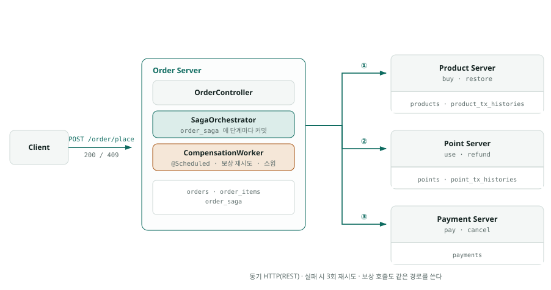

# ADR-0003 — A안 : 동기 HTTP 아키텍처

- **상태**: 승인.
- **날짜**: 2026-09-22
- **선행**: `docs/0002_saga_orchestration_design.md`. 사가를 왜 이렇게 쪼갰는지와 기각한 선택지는 그 문서가 갖는다.

## 1. 무엇을 만드나

- (AS-IS) 모놀리스를 (TO-BE) 4개의 서비스로 나누고, 주문 결제를 Order가 지휘하는 Saga로 처리한다.
- 서비스 간 통신은 동기 HTTP이고 메시지 브로커는 쓰지 않는다.

- **order**는 8080 포트에서 돌고 `order` 스키마를 `order_user` 계정으로 쓰며, 사가를 지휘하고 `POST /order`와 `POST /order/place`를 제공한다.
- **point**는 8081 포트에서 돌고 `point` 스키마를 `point_user` 계정으로 쓰며, 포인트 사용과 환불을 제공한다.
- **product**는 8082 포트에서 돌고 `product` 스키마를 `product_user` 계정으로 쓰며, 재고 차감과 복구를 제공한다.
- **payment**는 8083 포트에서 돌고 `payment` 스키마를 `payment_user` 계정으로 쓰며, 외부 승인 대역을 거쳐 결제를 기록하고 취소한다.
- **common**은 배포 단위가 아니라 네 서비스가 함께 쓰는 라이브러리 모듈이다.
- MySQL은 한 인스턴스에 스키마 네 개를 두고, 계정이 나뉘어 있어 남의 스키마에 접근하면 권한 오류가 난다.

## 2. 결정

- **A-1 사가 진행 상태는 단계마다 `order_saga`에 커밋한다.** 진행 상태가 호출 스택에만 있으면 프로세스가 죽었을 때 어디까지 갔는지 알 방법이 없다.
- **A-2 재시도는 API 클라이언트 경계에서 한다.** 정방향과 보상에 같은 정책이 자동으로 붙고, 비즈니스 실패인 `BusinessException`은 다시 불러도 결과가 같으므로 재시도하지 않는다.
- **A-3 타임아웃은 재고·포인트 1초, 결제 5초로 둔다.** 로컬 DB 작업이 1초를 넘으면 장애다. 재시도까지 더한 최악 지연은 약 27초이고, 클라이언트 타임아웃은 그보다 길어야 한다.
- **A-4 보상은 오케스트레이터가 즉시 부르고 실패하면 워커가 이어받는다.** 정상 실패는 수백 ms 안에 원복되고, 비정상 경로도 워커가 반복하므로 결국 수렴한다.
- **A-5 워커는 사가를 한 건씩 처리 직전에 `FOR UPDATE SKIP LOCKED`로 집고 `updated_at`을 지금으로 갱신한다.** 잠금은 집는 트랜잭션이 끝나면 풀리므로, 갱신한 `updated_at`이 60초 임계 동안 다른 워커가 같은 사가를 다시 집지 못하게 하는 임대 역할을 한다.
  후보를 한꺼번에 잠그면 잠금이 원격 호출 전에 풀려 아무것도 막지 못하고, 배치 뒤쪽 건은 차례를 기다리는 사이 임대가 끝난다.
  한 건의 최악 처리 시간(정방향 약 17초 + 인라인 보상 약 7초, 워커 보상 약 23초)은 임계보다 짧고, 단계마다 `updated_at`이 다시 갱신된다.
- **A-6 원격 실패는 호출한 쪽 API 클라이언트가 자기 에러 코드로 번역한다.** 원격 `code`를 그대로 통과시키면 상대 서비스의 코드 체계가 우리 계약으로 새어 나간다.
- **A-7 멀티모듈 한 레포로 가되 기술 인프라만 담는 `common`을 둔다.** 실패 응답의 모양은 네 서비스가 같아야 하는 기술 규약이지만, 요청·응답 DTO는 계약 그 자체라 공유하면 한쪽 변경이 다른 쪽을 강제 컴파일한다.
- **A-8 사가 상태는 `order_saga` 한 테이블에만 둔다.** 어느 단계까지 성공했는지가 이미 거기 있어서, 별도 대기열 테이블을 두면 같은 사실이 두 곳으로 갈라진다.
- **A-9 DB는 한 인스턴스에 스키마 네 개와 계정 네 개로 나눈다.** 경계를 규율이 아니라 권한으로 막으면 크로스 스키마 조인이 실수가 아니라 오류가 된다.
- **A-10 테스트는 전부 각 모듈에 두고 종단은 자동화하지 않는다.** 네 앱을 띄워야만 도는 테스트는 평소 `test`에서 늘 건너뛰게 되고, 건너뛰는 테스트는 있으나 마나다.
- **A-11 시드는 서비스별로 만들되 `productId`를 고정한다.** PK를 DB가 발급하면 기동할 때마다 다른 id가 생겨 종단 확인이 매번 달라진다.
- **A-12 네 프로세스를 실제로 띄우고 종단은 손으로 확인한다.** 한 JVM에 네 컨텍스트를 올리면 프로세스 경계가 사라져 크래시 시나리오를 돌릴 수 없다.
- **A-13 `ClockConfig`는 모듈마다 두되 타임존을 `Asia/Seoul`로 통일한다.** `order_saga.updated_at`이 스윕 임계의 기준이라 프로세스마다 타임존이 다르면 계산이 어긋난다.
- **A-14 상태를 가진 엔티티마다 Spring Statemachine을 쓴다.** 사가는 상태가 다섯인데 허용되는 전이가 메서드 이름에만 있어서, 끝난 사가를 다시 보상하는 호출이 조용히 통과했다.
- **A-15 ArchUnit 규칙은 `common`의 testFixtures에 한 벌만 두고 모듈이 상속한다.** 네 벌로 복제하면 갈라지고, 실제로 규칙이 order에만 있어 나머지 셋은 강제되지 않고 있었다.
- **A-16 타임아웃과 재시도 횟수는 설정이 아니라 코드의 정책 enum에 둔다.** 그 호출이 무엇을 하느냐에서 나오는 값이라 환경이 달라도 같아야 하고, `application.yml`에는 주소만 남는다.
- **A-17 멈춘 사가는 같은 `sagaId`로 `forward()`를 처음부터 재실행해 복구한다.** 모든 단계가 멱등이라 이미 한 것은 참여자가 기존 결과를 돌려주고, 이미 보상된 사가면 A-21의 가드가 거부하므로, 전진인지 보상인지를 워커가 판단할 필요가 없다.
- **A-18 보상은 성공 플래그로 거르지 않고 무조건 세 곳에 보낸다.** 원격 호출 성공과 로컬 커밋 사이에 프로세스가 죽으면 플래그가 거짓이 되고, 안 한 단계는 참여자가 `0`으로 답하고 CANCEL 가드를 남기므로 보내도 안전하다.
- **A-19 결제 중복 제약은 주문당 `PAID` 1건이고 DB가 `paid_order_id` unique로 강제한다.** `order_id` unique는 보상된 주문이 남긴 `CANCELED` 행 때문에 재결제를 영영 막는다.
  `paid_order_id`는 `PAID`일 때만 `order_id`를 갖고 취소하는 트랜잭션에서 `null`이 되며, MySQL unique는 `null`을 여럿 허용하므로 재결제는 열려 있다.
  서비스의 조회만으로는 서로 다른 사가 둘이 외부 승인 3초를 함께 기다리는 동안 둘 다 통과한다.
- **A-20 보상 재시도는 동기 경로에서 1회, 워커에서 3회 한다.** 동기 보상은 사용자가 기다리므로 짧게 끊어 워커에 넘기고, 워커는 스윕이 반복되므로 사실상 무한 재시도가 된다.
- **A-21 참여자는 `sagaId`마다 `saga_guards` 한 행으로 정방향과 보상을 직렬화한다.** order가 타임아웃으로 포기한 정방향이 참여자 안에서는 계속 진행되어, 먼저 도착한 보상이 `0`으로 끝난 뒤 커밋하면 차감이 영구히 남는다.
  정방향은 `FORWARD`, 보상은 `CANCEL`로 `INSERT … ON DUPLICATE KEY UPDATE`한 뒤 그 행을 `FOR UPDATE`로 읽고, 먼저 커밋한 쪽의 종류가 남는다.
  `INSERT IGNORE`는 중복 키에 공유 락을 잡아, 같은 `sagaId` 요청 둘이 이어서 배타 락을 요청하면 데드락이 나므로 쓰지 않는다. `ON DUPLICATE KEY UPDATE`는 처음부터 배타 락을 잡아 뒤에 온 요청이 줄을 선다.
  가드 잠금이 트랜잭션의 첫 조회여야 한다. 그보다 앞선 일반 조회가 RR 스냅샷을 과거에 고정하면 상대가 커밋한 이력이 보이지 않는다.
  기존 거래 이력의 unique에 표식을 넣는 방법은 `transaction_type`이 키에 있어 표식과 늦은 차감이 둘 다 들어가므로 기각했다.
  이력 조회를 잠금 읽기로 바꾸는 방법은 없는 키의 gap 락이 무관한 사가로 번지고, 보상 요청에 `userId`를 싣는 방법은 payment에 잠글 행이 없어 기각했다.
- **A-22 보상된 사가의 정방향은 `409 SAGA_ALREADY_COMPENSATED`로 거부한다.** `200` 무동작으로 답하면 `totalPrice`·`paymentId`에 넣을 값이 없고, 워커의 `forward()`가 세 단계를 성공으로 지나가 사가 플래그와 알림이 거짓이 된다.
- **A-23 정방향이 끝난 뒤의 실패는 보상하지 않고, 사가 안의 주문 전이는 대기형 락으로 한다.** `succeed`가 실패하면 사가를 `RUNNING`으로 남겨 워커가 같은 `sagaId`로 전진 복구하게 한다(A-17).
  `succeed`를 보상 경로 안에 두면 같은 주문의 재요청이 진입 트랜잭션에서 주문 행을 수 ms 쥐는 것만으로 NOWAIT가 실패해, 이미 승인된 결제와 차감이 통째로 되돌려진다.
  NOWAIT는 새 결제의 진입(`start`)만 거절하는 용도이고, `succeed`·`compensated`는 그 수 ms를 기다린다.

각 결정의 선택지와 기각 사유는 커밋 이력과 `docs/0002`가 갖는다.

### 상태 기계

- 그림에 더해 사가에는 `COMPENSATING`에서 `COMPENSATE`를 받으면 그대로 머무는 내부 전이가 있다. 워커가 `COMPENSATING`으로 멈춘 사가의 보상을 다시 시작하는 경로이고, 서비스가 상태를 `if`로 걸러 전이를 건너뛰지 않게 한다(A-14).

### 원격 호출 정책

- `LOCAL_WRITE`는 타임아웃 1초에 3회까지 시도하며, `product/buy`와 `point/use` 그리고 각각의 보상에 쓴다.
- `EXTERNAL_APPROVAL`은 타임아웃 5초에 2회까지 시도하며, 외부 승인 지연 3초를 품는 `payment`와 그 보상에 쓴다.
- 새 원격 호출을 만들 때는 값을 고르는 것이 아니라 **어느 특성인지**를 고른다.

## 3. 서비스 간 계약

- **재고 차감**은 `POST /product/buy`로 `{sagaId, orderId, items:[{productId, quantity}]}`를 보내면 같은 `productId`의 수량을 합쳐 차감하고 `200 {totalPrice}`를 돌려주고, 실패는 `409 INSUFFICIENT_STOCK`이나 `404 PRODUCT_NOT_FOUND`나 `409 SAGA_ALREADY_COMPENSATED`다.
- **재고 복구**는 `POST /product/buy/cancel`로 `{sagaId, orderId}`를 보내면 `200 {restoredPrice}`를 돌려주고, 비즈니스 실패는 없다.
- **포인트 사용**은 `POST /point/use`로 `{sagaId, orderId, userId, amount}`를 보내면 `200`을 돌려주고, 실패는 `409 INSUFFICIENT_POINT`나 `404 POINT_NOT_FOUND`나 `409 SAGA_ALREADY_COMPENSATED`다.
- **포인트 환불**은 `POST /point/use/cancel`로 `{sagaId, orderId}`를 보내면 `200 {refundedAmount}`를 돌려주고, 비즈니스 실패는 없다.
- **결제**는 `POST /payment`로 `{sagaId, orderId, userId, amount}`를 보내면 `200 {paymentId, paidAt}`를 돌려주고, 실패는 `409 ALREADY_PAID`나 `409 SAGA_ALREADY_COMPENSATED`다. 실제 PG가 없어 승인 거절이 일어나지 않으므로 payment는 `PAYMENT_FAILED`를 내지 않는다.
- **결제 취소**는 `POST /payment/cancel`로 `{sagaId, orderId}`를 보내면 `200`을 돌려주고, 비즈니스 실패는 없다.
- 실패 본문은 네 서비스가 모두 `{code, message}`로 같다.
- **`PAYMENT_FAILED`는 order가 붙이는 이름이다.** 결제 단계가 타임아웃이나 `5xx`로 실패해 원인을 모를 때 `RemoteErrorTranslator`가 이 코드로 떨어뜨린다.
- **보상은 비즈니스 실패로 응답하지 않는다.** 되돌릴 것이 없으면 `CANCEL` 가드를 남기고 `200`에 `0`을 주고, 이미 되돌렸으면 첫 번째 결과를 그대로 준다. 보상에서 나올 수 있는 실패는 연결 오류와 `5xx`뿐이고 그것만 재시도 대상이다.
- **보상 요청에 차감량이 없다.** 무엇을 얼마나 되돌릴지는 참여자가 `sagaId`로 자기 거래 이력에서 복원한다.
- **order가 클라이언트에 내는 실패 코드**는 `docs/0001` NFR-4 표의 코드에 더해 `INVALID_SAGA_STATE_TRANSITION`, 그리고 참여자 코드를 번역한 `ALREADY_PAID`·`PAYMENT_FAILED`·`SAGA_ALREADY_COMPENSATED`다. 모두 `409`다.
- **주문 생성은 줄마다 주문 수량을 `1..1,000`으로 받고 벗어나면 `400 INVALID_ORDER`다.** 입구에서 상한을 두어 참여자의 합산·가격 계산이 넘칠 수 없게 한다. 참여자는 넘침을 조용히 감지 않고 실패시킨다(`Math.addExact`·`multiplyExact`).
- **결제가 진행 중인 주문을 다시 결제하면 `409 INVALID_ORDER_STATE_TRANSITION`이다.** `ORDER_LOCKED`는 두 요청의 진입 트랜잭션이 수 ms 안에 겹쳐 NOWAIT가 실패할 때만 난다.
- **`SAGA_ALREADY_COMPENSATED`는 그 `sagaId`에 보상 가드가 있거나 이미 되돌린 이력이 있다는 뜻이다.** order는 이 코드를 세 `*ErrorCode` 사본에 두어 폴백으로 떨어뜨리지 않는다.

## 4. 스키마

- 정본은 각 서비스의 `@Entity`이고, `ddl-auto: create`라 마이그레이션 도구는 없다.
- `order_saga`(신설)는 `saga_id` unique와 `status`, `current_step`, `stock_done`·`point_done`·`payment_done`, `total_price`, `attempts`, `last_error`, `updated_at`을 갖는다.
- `product_transaction_histories`(신설)는 `UNIQUE(saga_id, product_id, transaction_type)`로 같은 사가가 같은 상품을 두 번 차감하거나 두 번 되돌리는 것을 막는다.
- `point_transaction_histories`(신설)는 `UNIQUE(saga_id, transaction_type)`로 같은 일을 한다.
- `payments`(변경)에는 `saga_id` unique가 붙고 `status`에 `CANCELED`가 추가되며, `order_id` unique는 A-19에 따라 제거되고 `paid_order_id` unique(`uk_payments_paid_order_id`)가 붙었다.
- `saga_guards`(신설)는 product·point·payment에 같은 모양으로 있고 `saga_id` PK와 `kind`(`FORWARD`·`CANCEL`), `created_at`을 갖는다.
  한 번 넣으면 바꾸지 않고 지우지도 않는다. 지운 사가는 늦은 정방향을 다시 막을 수 없다.
- `orders`(변경)에는 `status`에 `PLACING`과 `FAILED`가 추가되고 `updated_at`이 붙는다. `updated_at`이 없으면 스윕 질의가 성립하지 않는다.
- 거래 이력의 unique 제약은 `payments.saga_id` unique와 같은 역할이다. 코드의 멱등 분기가 뚫려도 DB가 마지막에 막는다.

## 5. 보상 워커

- `CompensationWorker`는 별도 프로세스가 아니라 order 앱 안의 `@Scheduled` 폴링 빈이다.
- **10초마다** 깨어난다. 이미 실패한 사가를 치우는 일이라 초 단위 지연이 의미가 없다.
- **`updated_at`이 60초를 넘긴** 사가를 멈춘 것으로 본다. 최악 지연 27초보다 넉넉히 길어야 살아 있는 사가를 건드리지 않는다.
- **한 번에 20건**을 후보로 고르고, 한 건씩 처리 직전에 `FOR UPDATE SKIP LOCKED`로 다시 확인하며 `updated_at`을 갱신해 집는다(A-5). 인덱스는 `order_saga(status, updated_at)`이다.
- 대상은 `RUNNING`, `COMPENSATING`, `COMPENSATION_FAILED` 세 상태다. 앞은 고아 사가이고 뒤 둘은 보상이 덜 끝난 사가다.
- `RUNNING`이면 `forward()`를 재실행하고, 나머지는 보상을 다시 돌린다. 한 건이 터져도 나머지 처리를 막지 않는다.
- 실패하면 `updated_at`이 갱신되어 임계 뒤에 다시 집히므로, **스윕 반복 자체가 무한 재시도**가 된다.
- 워커마저 실패하면 `AlertSender`가 알림을 보내 사람이 개입한다. 지금 구현은 로그만 남기는 대역이다.
- 참여자에서 정방향이 가드를 쥔 채 행 락을 기다리면 같은 사가의 보상도 가드에서 기다리다 타임아웃해 `COMPENSATION_FAILED`가 된다.
  정방향이 끝나면 워커의 다음 보상이 그 결과를 되돌리므로, 수렴은 늦어져도 정합성은 깨지지 않는다.
- **실측**: 결제 도중 order를 `kill -9` 하면 재고와 포인트가 차감되고 `payments`가 `PAID`인 채 `PLACING`/`RUNNING` 고아가 남는다. 재기동 후 약 60초에 워커가 같은 `sagaId`로 정방향을 재실행했고, 모든 단계가 기존 결과를 돌려주어 `COMPLETED`/`SUCCEEDED`로 전진 복구됐다. 장애별 실측은 §6에 있다.

## 6. 장애 주입 실측

- 4개의 서비스를 각각 프로세스로 띄우고 order와 참여자 사이에 TCP 프록시를 끼워 장애를 주입했다. 주입 종류는 연결 거부와 응답 유실과 응답 지연 세 가지이고 오케스트레이터 크래시는 `kill -9`로 발생시켰다.
- 장애를 주입하는 동안 같은 참여자를 쓰는 다른 사가가 함께 영향을 받으므로 시나리오는 하나씩 돌렸다. 병렬인 것은 네 앱을 동시에 띄우는 것까지다.
- 수렴 판정은 다섯 가지 불변식으로 했다. 
  - 고아 사가 0건.
  - 주문 상태와 사가 상태 일치. 
  - 주문당 `PAID` 최대 1건. 
  - 성공한 주문만 `PAID` 보유.
  - 재고와 잔액이 성공한 주문의 합과 정확히 일치.
- **Point 서버 다운** — `point/use`가 재시도 3회를 0.7초에 소진했고 보상 호출까지 거부되어 `COMPENSATION_FAILED`로 남았다. point를 되살리자 약 70초에 워커가 집어 `COMPENSATED`로 닫았고 재고가 정확히 복구됐다.
- **포인트 차감 직후 응답 유실** — `point/use`의 응답을 세 번 모두 버렸는데도 point의 거래 이력에는 `USE`가 한 줄만 남았다. `sagaId` 멱등이 재시도를 흡수했고 환불도 한 번만 일어나 잔액이 정확히 원복됐다.
- **결제 3초 중 타임아웃** — 응답을 7초 늦춰 `EXTERNAL_APPROVAL`의 5초를 넘겼다. order는 두 번 다 타임아웃했지만 `payments`에는 `PAID`가 한 줄만 생겼고 보상이 그것을 `CANCELED`로 돌렸다. 워커를 거치지 않고 동기 경로에서 닫혔다.
- **오케스트레이터가 결제 도중 크래시** — 세 단계가 모두 실제로는 성공한 뒤 order만 죽어 `PLACING`/`RUNNING` 고아가 남았다. 재기동 후 약 60초에 워커가 같은 `sagaId`로 `forward()`를 재실행했고 모든 단계가 기존 결과를 돌려주어 `COMPLETED`/`SUCCEEDED`로 전진 복구됐다. 재고와 잔액은 한 번만 차감된 상태 그대로였다.
- **보상 대상이 다운된 채 비즈니스 실패** — 잔액 부족으로 `409 INSUFFICIENT_POINT`가 즉시 나갔지만 재고 복구가 거부되어 `COMPENSATION_FAILED`가 됐고 `AlertSender`가 울렸다. product를 되살리자 약 60초에 워커가 재고 60개를 정확히 되돌렸다.
- 이 마지막 건은 클라이언트가 `409`를 받은 시점에 재고가 아직 안 돌아와 있다는 `docs/0002` §10.6의 대가를 실제로 보여 준다.
- 주문 여덟 건이 끝난 뒤 불변식 다섯 가지가 모두 통과했다. 성공한 세 건은 `COMPLETED`/`SUCCEEDED`이고 실패한 다섯 건은 `FAILED`/`COMPENSATED`이며 고아 사가는 없었다.
- 수렴 시간의 상한은 스윕 주기 10초와 정지 임계 60초의 합이고 관측값은 60초에서 70초 사이였다.
