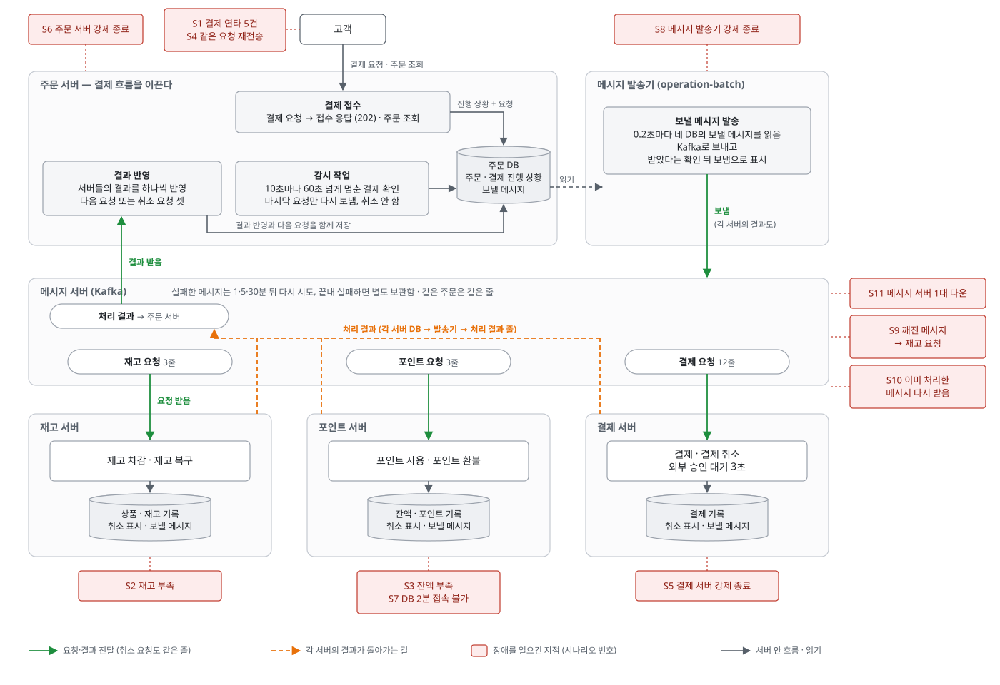

# 비동기 사가 KPI 리포트

- **측정일**: 2026-09-26
- **대상**: 주문 결제 `POST /order/place` (Kafka 메시지 + Outbox로 도는 사가)
- **질문**: 결제 도중 서버·DB·Kafka가 망가져도, 복구된 뒤 재고·포인트·결제가 정확히 맞는가

## 결론

- 장애 20가지를 실제로 일으켰고, 어떤 경우에도 **이중 차감·이중 결제가 없었다.**
- 결제 요청은 장애 중에도 항상 0.12초 안에 `202`(접수)를 받았다.
- 재고·잔액 부족 같은 비즈니스 실패는 1.5초 안에 되돌렸다.
- 서버·DB·Kafka 장애는 되돌리지 않고 기다렸다가, 복구된 뒤 대부분 15초 안에 결제를 끝냈다.
- 대신 PG 지연·DB 장애·배포 같은 흔한 일에 전체가 함께 느려지거나 멈추고 ([안정성](#안정성)), 실제 결제 처리량은 초당 약 3.4건이다 ([성능](#성능)).
- 정한 목표 (초당 10건, 정상 완료 5초, 장애 뒤 30초, 5분 안에 알림)와 비교하면 처리량과 부하 중 완료 시간이 미달이다 ([목표 대비](#목표-대비)).

## 먼저 알아 둘 용어

| 용어               | 이 리포트에서의 뜻                                                                                                         |
|--------------------|----------------------------------------------------------------------------------------------------------------------------|
| 사가               | 재고 차감 → 포인트 사용 → 결제를 서비스 셋에 나눠 차례로 처리하는 흐름. order가 지휘한다                                   |
| 보상               | 앞 단계가 실패했을 때 이미 한 일을 되돌리는 요청 (재고 복구, 포인트 환불, 결제 취소)                                       |
| outbox             | 보낼 메시지를 DB 테이블에 먼저 적어 두는 방식. 비즈니스 변경과 같은 트랜잭션이라 "DB엔 반영됐는데 메시지는 안 나감"이 없다 |
| 릴레이             | outbox 테이블을 읽어 Kafka로 보내는 별도 앱 (operation-batch)                                                              |
| 멱등               | 같은 요청이 두 번 와도 결과가 한 번 처리한 것과 같음. 여기서는 `sagaId`와 거래 이력으로 판단한다                           |
| 워치독             | 60초 넘게 멈춘 사가를 찾아 마지막 요청을 다시 보내는 order 안의 스케줄러. 되돌리지는 않는다                                |
| 재시도 토픽 / DLT  | 처리에 실패한 메시지를 1분·5분·30분 뒤에 다시 시도하는 토픽 / 끝내 실패한 메시지가 모이는 토픽                             |
| 파티션             | 토픽을 나눈 칸. 한 칸 안의 메시지는 한 번에 하나씩 순서대로 처리된다                                                       |
| 컨슈머 그룹·오프셋 | 메시지를 나눠 읽는 인스턴스 묶음 / 어디까지 읽었는지 적어 둔 위치                                                          |
| 리밸런싱           | 인스턴스가 죽거나 늘 때 파티션을 인스턴스에 다시 나눠 주는 일                                                              |

## 시스템이 움직이는 방식

1. order는 결제 요청을 받으면 사가와 첫 요청 (재고 차감)을 outbox에 적고 바로 `202`를 돌려준다.
2. 릴레이가 outbox를 0.2초마다 읽어 Kafka로 보낸다.
3. product → point → payment가 차례로 처리하고, 결과를 자기 outbox에 적어 order에 돌려준다.
4. 중간에 비즈니스 실패가 나면 order가 세 곳 모두에 보상을 보낸다.
5. 서버·DB 장애는 보상하지 않는다. 메시지를 다시 시도하고, 워치독이 멈춘 사가를 다시 밀어 준다.

결과는 `GET /order/{orderId}`로 확인한다.

## 결과 한눈에

"걸린 시간"은 결제 요청부터 최종 결과가 확정될 때까지다. 괄호 안은 장애가 풀린 뒤부터 잰 시간이다.

| #   | 무엇을 망가뜨렸나                       | 결과                          | 걸린 시간        |
|-----|-----------------------------------------|-------------------------------|------------------|
| S0  | 없음 (기준선)                           | 완료                          | 4.3초            |
| S7  | 같은 주문에 결제 요청 5건 동시          | 1건만 접수, 4건은 `409`       | 4.4초            |
| S1  | 재고 부족                               | 보상 뒤 실패 처리             | 0.9초            |
| S2  | 잔액 부족                               | 이미 뺀 재고 60개 복구        | 1.4초            |
| S14 | 실패한 결제를 같은 키로 재요청          | 새 결제가 생기지 않음         | 즉시             |
| S3  | payment 서버 90초 다운                  | 재기동 뒤 완료, 보상 없음     | 100.8초 (6.7초)  |
| S4  | payment 서버 90초 멈춤                  | 풀린 뒤 완료                  | 94.1초 (4.0초)   |
| S5  | 결제 중 order 서버 다운                 | 재기동 뒤 완료                | 46.4초 (41.1초)  |
| S6  | 주문 행을 다른 세션이 60초 잠금         | 풀린 뒤 완료                  | 61.2초 (0.2초)   |
| S12 | point DB 2분 접속 불가                  | 복구 뒤 완료                  | 125.4초 (5.0초)  |
| S8  | 릴레이 90초 다운                        | 재기동 뒤 완료                | 96.6초 (4.6초)   |
| S9  | Kafka 90초 정지                         | 풀린 뒤 완료                  | 104.7초 (14.5초) |
| S10 | 모든 메시지를 두 번씩 발행              | 한 번만 반영                  | 4.4초            |
| S11 | 해석할 수 없는 메시지                   | DLT로 격리, 옆 주문은 정상    | 4.5초            |
| S13 | 늦게 온 옛 실패 응답                    | 무시                          | 4.6초            |
| S15 | 이미 처리한 메시지 16건 재전달          | 원장 변화 없음                | —                |
| S16 | 결제 중 payment 인스턴스 하나 70초 멈춤 | 다른 인스턴스가 이어받아 완료 | 최대 76.5초      |
| S17 | 되돌린 사가에 늦게 온 요청 3건          | 모두 거부                     | —                |
| S18 | point DB 4분 접속 불가                  | 재시도 토픽을 거쳐 완료       | 245.6초 (5.5초)  |
| S19 | Kafka 브로커 3대 중 1대 다운            | 60건 모두 완료                | 건당 최대 19.1초 |

## 시나리오별 설명

다이어그램의 서비스 사이 화살표는 "보내는 쪽 outbox → 릴레이 → Kafka → 받는 쪽"을 줄여 그린 것이다.

### 1. 정상과 비즈니스 실패

**S0 장애 없음.** 접수 0.02초, 완료 4.3초다. 그중 3초는 결제 승인 지연 (외부 PG 대역)이다.

**S7 같은 주문에 결제 5건 동시.** 주문 행을 `NOWAIT`로 잠그므로 1건만 들어가고, 4건은 0.07초에 `409 ORDER_LOCKED`를 받았다. 결제는 한 번이었다.

**S1 재고 부족 / S2 잔액 부족.** 실패하면 order가 결제 취소·포인트 환불·재고 복구 세 가지를 모두 보낸다. 한 적 없는 단계의 보상은 "되돌릴 것 없음"으로 성공 처리된다. S2에서는 이미 뺀 재고
60개가 1.1초 동안 보였다가 복구됐다.

**S14 같은 키로 재요청.** 같은 `Idempotency-Key`로 다시 보내면 새 사가를 만들지 않고 `202`만 준다. 조회하면 처음 실패 결과가 그대로 보인다.

### 2. 서버나 DB가 죽거나 멈춤

다섯 경우 모두 **보상하지 않고 기다렸다가 끝냈다.** 요청은 Kafka에 남아 있으니, 받을 쪽이 살아나면 이어서 처리하면 되기 때문이다.

**S3 payment 다운 / S4 payment 멈춤.** 결제 요청이 토픽에 쌓여 있다가 payment가 돌아오자 처리됐다. 그사이 워치독이 결제 요청을 한 번 더 보냈지만, payment가 결제 이력을 보고
두 번째는 건너뛰었다. 결제 행은 1건이다.

**S5 결제 중 order 다운.** 결제 결과는 Kafka에 남아 있어 잃지 않았다. 하지만 order를 바로 재기동했는데도 41초 동안 그 결과를 읽지 못했다 ([안정성](#안정성)).

**S6 주문 행 잠금.** 결제는 끝났는데, 결과를 반영하려는 order가 행 잠금을 기다렸다. 잠금이 풀리고 0.2초 만에 완료됐다.

**S12 point DB 2분 접속 불가.** point는 같은 메시지를 계속 재시도했고, DB가 돌아온 지 5초 만에 완료됐다. 다만 그 2분 동안 파티션 하나가 통째로 막혀 있었다
([안정성](#안정성)).

### 3. 메시지 전달 계층 (릴레이·Kafka) 장애

**S8 릴레이 다운.** 첫 요청이 outbox에 머물러 아무것도 차감되지 않았다. 워치독은 "아직 안 나간 요청이 있다"를 알아보고 재발행하지 않고 기다렸다. 릴레이가 돌아오자 4.6초 만에 끝났다.

**S9 Kafka 정지.** 릴레이는 발행 실패를 "영구 실패"로 세지 않고 계속 다시 시도했다. 눈여겨볼 점은, 정지 중에 "타임아웃"으로 끝난 발행이 실제로는 Kafka에 들어가 있었다는 것이다. 그래서 재고
차감 요청이 두 번 전달됐지만, product가 재고 이력을 보고 한 번만 뺐다.

**S10 모든 메시지 두 번씩 발행.** 릴레이가 "보냈다"고 표시하기 전에 죽는 상황을 흉내 냈다. 메시지 9개가 모두 두 번씩 나갔지만, 결과는 정상 결제와 같았고 걸린 시간도 같았다.

**S11 해석할 수 없는 메시지.** 깨진 메시지는 재시도 없이 0.6초 만에 DLT로 가서 알림을 냈다. 같은 파티션 바로 뒤에 있던 정상 주문은 기다리지 않고 4.5초에 끝났다.

**S13 늦게 온 옛 실패 응답.** 사가가 이미 결제 단계인데 "포인트 부족" 응답이 뒤늦게 오자, order는 지금 단계와 맞지 않는 응답이라 무시했다.

### 4. Kafka를 쓰면 생기는 문제

**S15 이미 처리한 메시지 재전달.** 컨슈머는 DB 커밋 뒤에 "여기까지 읽었다"(오프셋)를 기록한다. 그 사이에 죽으면 같은 메시지를 다시 받는다. 오프셋을 되돌려 이 상황을 만들었더니, 커맨드 8건과 응답
8건이 다시 흘렀지만 원장은 한 치도 바뀌지 않았다. 중복 판단을 오프셋이 아니라 `sagaId`와 거래 이력으로 하기 때문이다.

**S16 결제 중 인스턴스 하나 멈춤 (리밸런싱).** payment를 2대로 띄우고 한 대 (A)를 결제 도중 멈췄다. A의 파티션이 다른 인스턴스 (B)로 넘어갔고, 70초 뒤 풀린 A는 모른 채 하던 결제를
마저 끝냈다. B도 같은 요청을 다시 받았지만, A가 잡고 있던 잠금이 풀리길 기다린 뒤 결제 이력을 보고 건너뛰었다. 결제는 주문당 1건이다.

**S17 되돌린 사가에 늦게 온 요청.** 재시도 토픽을 거친 요청은 몇 분 늦게 올 수 있다. 이미 보상이 끝난 사가에 재고 차감·포인트 사용·결제 요청이 오자, 세 서비스 모두
`SAGA_ALREADY_COMPENSATED`로 거부했다. 복구된 재고 60개가 다시 빠지지 않았다.

**S18 point DB 4분 접속 불가.** S12보다 길게 끊자, 제자리 재시도를 다 쓰고 재시도 토픽으로 1건이 넘어갔다. 워치독은 세 번째 재발행에서 "사람이 봐야 한다" 알림을 냈다. DB가 돌아오고
5.5초 만에 끝났고, DLT로 간 메시지는 없었다.

**S19 브로커 3대 중 1대 다운.** 브로커 3대 (복제 3)로 따로 띄우고, 결제 60건을 흘리는 중에 리더를 가장 많이 가진 브로커를 죽였다. 60건 모두 접수되고 끝났지만, 건당 걸린 시간이 4초대에서
최대 19초로 늘었다 ([안정성](#안정성)).

## 안정성

**잘 되는 것: 돈과 재고는 틀리지 않는다.**
운영에서 흔히 생기는 메시지 중복, 재시도, 늦게 온 메시지, 재기동을 모두 흡수했다.
20가지 장애에서 이중 차감·이중 결제가 0건이었다.

**운영에서 자주 겪을 문제**는 아래와 같다. 원장은 모두 맞았지만, 한 곳의 문제로 전체가 함께 느려지거나 멈춘다.

| 상황                            | 얼마나 자주  | 어떻게 되나                                                                                                                                        | 근거                                                  |
|---------------------------------|--------------|----------------------------------------------------------------------------------------------------------------------------------------------------|-------------------------------------------------------|
| 외부 결제 (PG)가 느려짐         | 가장 흔함    | payment는 파티션마다 한 건씩 처리해, 승인이 느려지면 뒤 결제가 줄을 선다                                                                           | 3초 지연만으로도 몰린 파티션에서 최대 16초 대기 (S19) |
| DB 재시작·장애 조치             | 흔함         | 멈춘 동안 결제가 진행되지 않고, 이미 뺀 재고·포인트는 빠진 채 "처리 중"으로 남는다. 재시도 한 번마다 커넥션을 30초 기다려 파티션 하나가 2분 막혔다 | DB 2분 장애, 복구 뒤 5초에 완료 (S12)                 |
| 앱이 죽었다가 다시 뜸           | 배포·장애 때 | 죽은 컨슈머를 Kafka가 알아채는 데 기본 45초가 걸려, 다시 뜬 앱이 그동안 메시지를 읽지 못한다                                                       | order 재기동 뒤 41초 공백 (S5)                        |
| 릴레이 (operation-batch) 재시작 | 배포 때마다  | 릴레이가 하나뿐이라 멈춘 동안 모든 결제가 멈춘다                                                                                                   | 재기동 뒤 4.6초에 이어짐 (S8)                         |
| Kafka 브로커 1대 장애           | 가끔         | 죽은 브로커로 보낸 요청이 타임아웃 (5초)을 기다리는 동안 릴레이가 나머지 메시지도 보내지 않는다. 풀린 뒤 몰린 결제가 줄을 선다                     | 릴레이 약 10초 정지, 건당 최대 19.1초 (S19)           |

## 성능

| 항목                                | 수치                                                             | 근거      |
|-------------------------------------|------------------------------------------------------------------|-----------|
| 결제 요청 응답 (`202`)              | 0.02~0.06초. 장애 중에도, 초당 10건 부하에서도 같음              | 실측      |
| 결제 완료까지 (부하 없음)           | 약 4.3초. 그중 3초는 PG 승인 대기, 나머지 약 1.3초는 메시지 전달 | 실측 (S0) |
| 결제 처리량                         | 초당 약 3.4건                                                    | 부하 측정 |
| 부하 중 결제 완료 (초당 4건, 30초)  | 중앙값 7.9초, 최대 30.8초. 5초 안에 끝난 건 120건 중 36건        | 부하 측정 |
| 부하 중 결제 완료 (초당 10건, 60초) | 중앙값 48.5초, 최대 117.7초. 5초 안에 끝난 건 600건 중 16건      | 부하 측정 |

가장 먼저 부딪히는 병목은 처리량이다.
payment는 파티션 12개가 각자 3초에 한 건씩 처리하므로 계산상 상한은 초당 4건이다.
실제로는 주문 번호 해시로 파티션이 정해져 부하가 고르게 나뉘지 않아, 초당 약 3.4건에서 막혔다.
그래서 초당 4건부터 이미 줄이 생겼고, 초당 10건에서는 늦게 넣은 주문일수록 완료 시간이 계속 늘었다.

부하 중에도 원장은 맞았다.
720건 모두 완료됐고, 재고 720개·포인트 72,000·결제 720건이 정확히 한 번씩이었다.
다만 60초 넘게 기다린 사가에 워치독이 결제 요청을 137번 다시 보냈다. 멱등이라 결과는 맞지만, 이미 밀린 큐에 일을 더 얹는다.
결제가 최대 2분 걸렸어도 워치독 알림 (약 3분)에 닿지 않아, 과부하 동안 알림은 한 번도 나가지 않았다.

## 한계

설계에서 일부러 감수한 것들이다.

1. **결과를 바로 알 수 없다.** 클라이언트는 `202`를 받은 뒤 조회 API로 결과를 확인해야 한다.
2. **중간 상태가 보인다.** 정상일 때는 1초 남짓이지만, 장애가 나면 그 길이만큼 재고·포인트가 빠진 채로 보인다 (S3 100초, S12 125초).
3. **장애가 길어도 자동으로 되돌리지 않는다.** 서버 장애는 보상하지 않고 기다리는 설계라, 몇 시간짜리 장애면 주문도 몇 시간 "처리 중"이다. 사람에게 알리는 것은 워치독 알림 (재발행 3회째)뿐이다.
4. **DB가 한 대다.** 네 서비스의 스키마가 MySQL 한 대에 있어, DB 장애는 곧 전체 장애다.

## 목표 대비

목표는 설계 문서 (`docs/0004` B-20)에서 정했다.

| 목표                               | 결과                                                                                       | 근거                             |
|------------------------------------|--------------------------------------------------------------------------------------------|----------------------------------|
| 결제 요청 초당 10건                | **미달.** 실제 상한은 초당 약 3.4건                                                        | 부하 측정                        |
| 장애가 없을 때 결제 완료 5초 이내  | **부하가 없을 때만 달성.** 한 건씩은 4.3~4.6초, 초당 4건에서 30%·초당 10건에서 3%만 5초 안 | S0·S7·S10·S11·S13, 부하 측정     |
| 장애가 걷힌 뒤 30초 이내 완료      | **7건 중 6건 달성.** order 재기동만 41.1초                                                 | S3·S4·S6·S8·S9·S12 달성, S5 미달 |
| 결제가 끝나지 않으면 5분 이내 알림 | **달성.** 결제 요청 뒤 약 3분 (181초)에 워치독 알림                                        | S18                              |

가장 큰 격차는 처리량이다. 완료 5초가 부하에서 깨지는 것도 처리량이 모자라서다.

## 어떻게 쟀나

다섯 앱 (order·product·point·payment·릴레이)을 로컬에서 띄우고, 장애는 모두 앱 밖에서 넣었다. 코드에 장애용 장치가 없으니, 잰 코드가 곧 실제 코드다.

| 장애를 낸 방법                                                 | 시나리오           |
|----------------------------------------------------------------|--------------------|
| 주문 수량·금액 조절                                            | S1, S2             |
| 동시 요청, 같은 키 재요청                                      | S7, S14            |
| 프로세스 강제 종료 (`kill -9`)                                 | S3, S5, S8         |
| 프로세스 일시 정지 (`SIGSTOP` → `SIGCONT`)                     | S4, S16            |
| 다른 DB 세션으로 행 잠금                                       | S6                 |
| DB 계정 잠금                                                   | S12, S18           |
| Kafka 컨테이너 정지 (`docker pause`)                           | S9                 |
| outbox 행을 다시 "보낼 것"으로 되돌리거나 직접 넣기            | S10, S11, S13, S17 |
| 컨슈머 오프셋 되감기                                           | S15                |
| 브로커 3대 클러스터에서 1대 강제 종료                          | S19                |
| 일정한 속도로 결제 요청 (초당 4건 30초, 이어서 초당 10건 60초) | 부하 측정          |

판정은 로그가 아니라 DB 원장으로 했다. 0.15초마다 네 DB를 읽어 다음을 확인했다.

- 되돌린 주문은 재고·포인트 순변화 0, 결제 없음
- 완료한 주문은 주문한 만큼 정확히 한 번 차감, 결제 1건
- 끝난 뒤 "시드 − 이력 = 현재 재고·잔액"이 맞고, 멈춘 사가·처리 중 주문·안 나간 outbox가 0건

판정 142개 중 141개가 통과했다. 실패 1개 (S10)는 측정 스크립트가 메시지 수를 6개로 잘못 가정한 탓이다. 실제로는 9개였고, 9개 모두 두 번씩 나갔다.

## 측정 조건

- 시나리오마다 한 번씩 쟀다. 같은 조건으로 다시 재면 수치가 조금 다를 수 있다.
- MySQL 1대, 앱은 인스턴스 1대씩 (S16의 payment만 2대), Kafka 브로커 1대 (S19만 3대)인 로컬 환경이다.
- 앱을 띄운 직후 첫 결제는 준비 비용 때문에 1~2초 더 느려서, 측정 전에 한 건을 돌리고 수치에서 뺐다.
- S15·S18은 측정 스크립트 버그로 첫 결과를 버리고 다시 쟀다.
- 부하 측정은 재고와 잔액을 SQL로 넉넉히 채운 뒤 했다. 소스와 설정은 그대로다.
- 2026-09-26 코드 기준이다. 재시도·복구 설정을 바꾸면 수치도 바뀐다.
