# 비동기 사가 오케스트레이션 KPI 리포트

### S0 장애가 없을 때

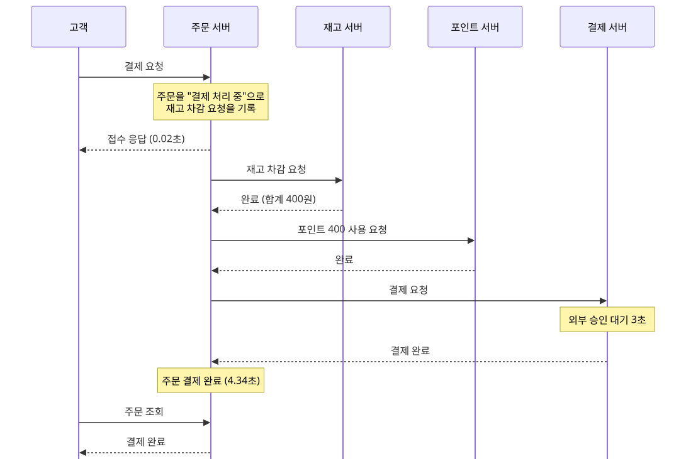

- **Given** 사용자 1이 상품1 2개와 상품2 1개 (400원)를 주문했다.
- **When** 주문을 결제하면
- **Then** 접수되고, 주문이 결제 완료 (`COMPLETED`)가 된다.
- **Then** 재고·포인트가 한 번 빠지고 결제가 1건 기록되며, 6초 안에 끝난다.

### S1 같은 주문에 결제 요청 5건이 동시에 올 때

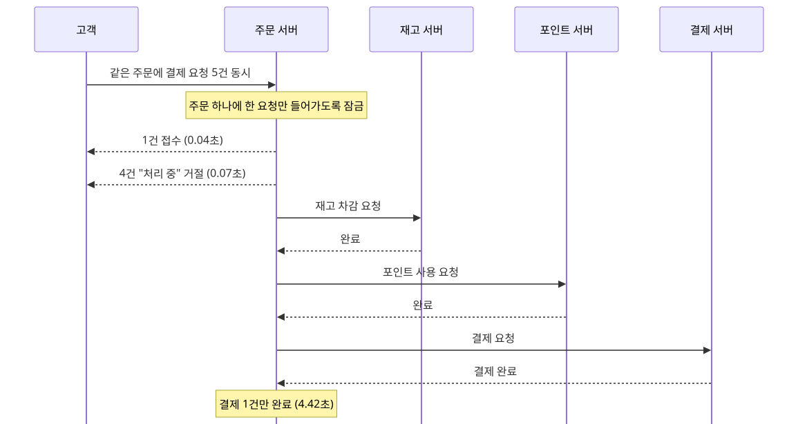

- **Given** 결제 전 주문 하나가 있다.
- **When** 요청 키가 서로 다른 다섯 요청이 한꺼번에 결제를 시작하면
- **Then** 정확히 1건만 접수되고, 나머지는 거절된다. 첫 요청이 주문을 잡고 있는 동안 도착하면 "처리 중" (`409 ORDER_LOCKED`), 첫 요청이 끝난 뒤 도착하면 "결제할 수 없는 상태" (`409 INVALID_ORDER_STATE_TRANSITION`)다. 이번 측정에서는 4건 모두 `409 ORDER_LOCKED`였다.
- **Then** 재고·포인트·결제가 한 번만 반영된다.

### S2 재고보다 많이 주문했을 때

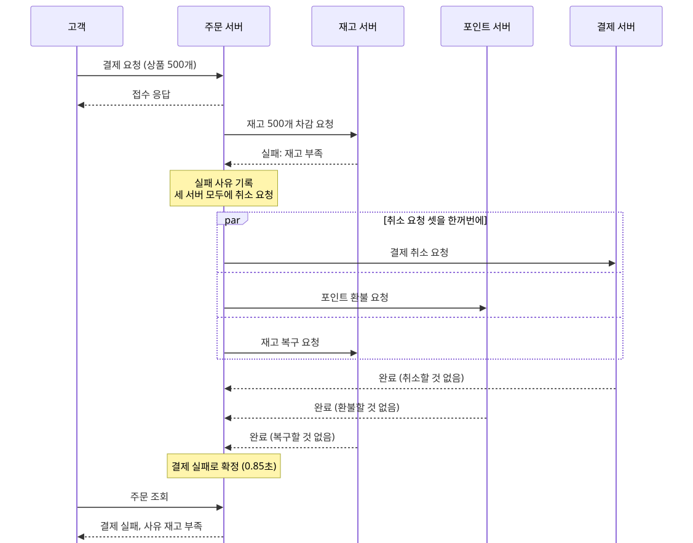

- **Given** 재고 100개인 상품1을 500개 주문했다.
- **When** 주문을 결제하면
- **Then** 주문이 결제 실패 (`FAILED`)로 확정되고, 조회하면 사유 "재고 부족" (`INSUFFICIENT_STOCK`)이 보인다.
- **Then** 재고·포인트는 그대로이고 결제 기록이 없으며, 2초 안에 끝난다.

### S3 잔액보다 비싼 주문일 때

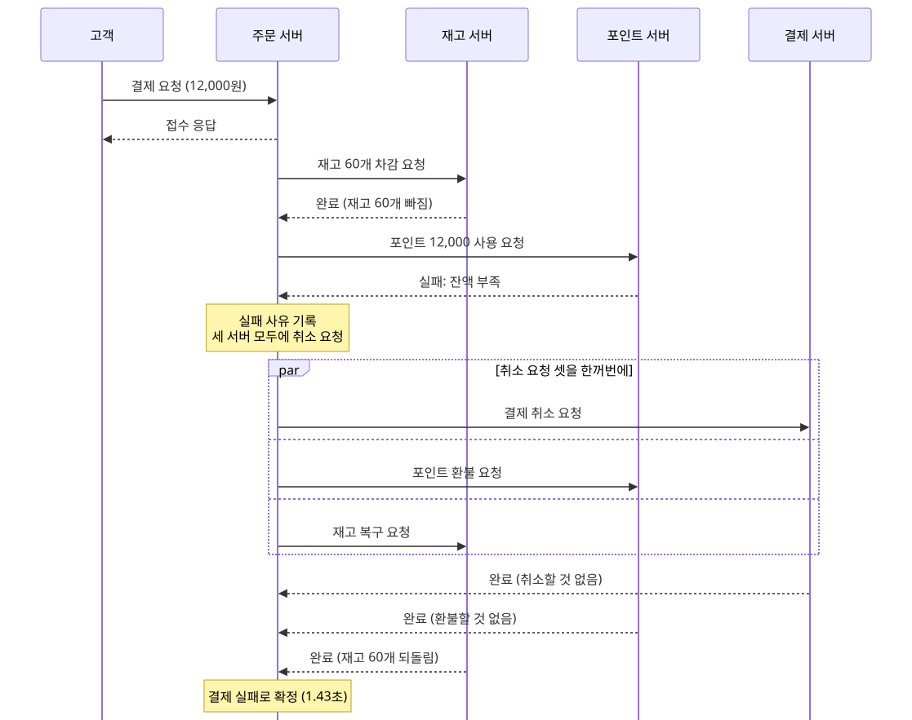

- **Given** 잔액 10,000원인 사용자 2가 상품2 60개 (12,000원)를 주문했다.
- **When** 주문을 결제하면
- **Then** 주문이 결제 실패로 확정되고, 사유 "잔액 부족" (`INSUFFICIENT_POINT`)이 보인다.
- **Then** 먼저 뺀 재고 60개가 되돌아와 최종 차감량이 0이고, 2초 안에 끝난다.

### S4 실패한 결제를 같은 키로 다시 요청할 때

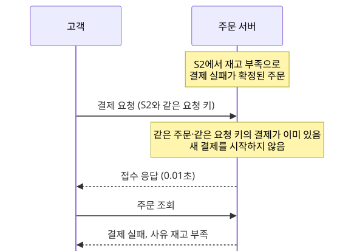

- **Given** S2에서 실패한 주문이 있다.
- **When** S2와 같은 요청 키 (`Idempotency-Key`)로 다시 결제하면
- **Then** 접수 응답은 오지만 새 결제가 시작되지 않는다.
- **Then** 조회하면 처음 실패 결과 ("재고 부족")가 그대로 보인다.

### S5 결제 서버가 죽어 있을 때

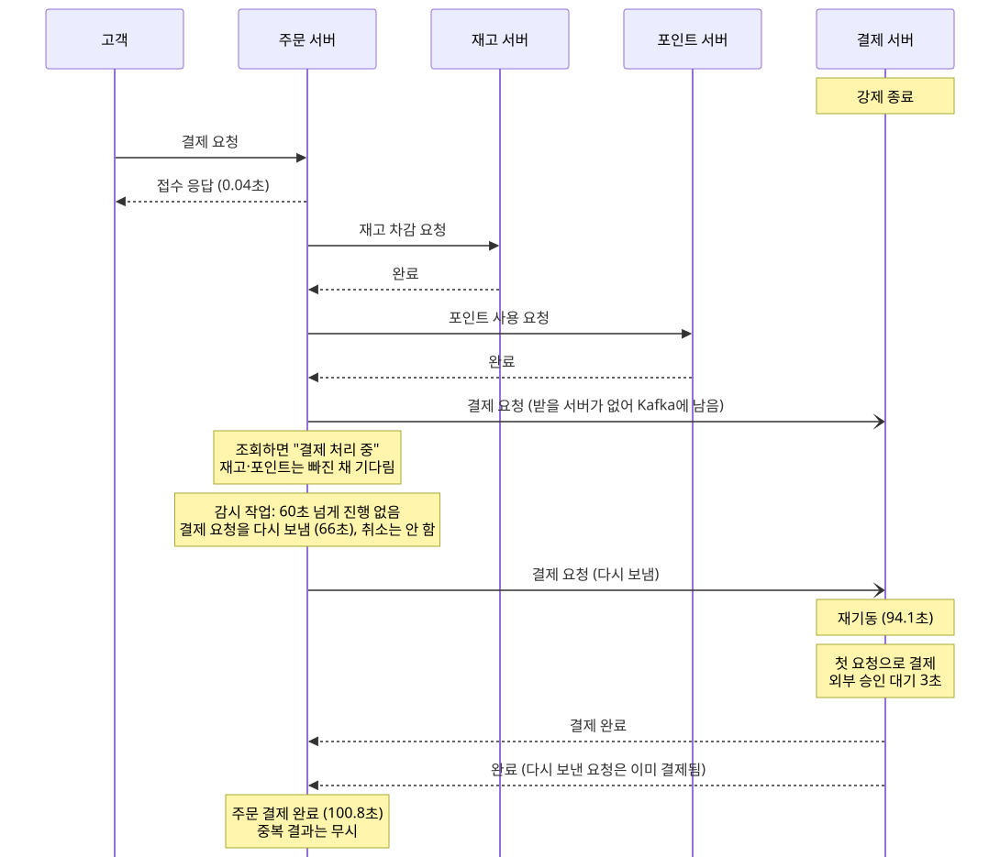

- **Given** 결제 서버를 강제로 종료했다.
- **When** 주문을 결제하고 90초 뒤 결제 서버를 다시 띄우면
- **Then** 장애 중 조회는 "결제 처리 중"이고, 결제를 취소하지 않는다.
- **Then** 서버가 돌아오면 결제를 마저 완료하고, 결제는 1건이다.

### S6 결제 승인을 기다리는 중에 주문 서버가 죽을 때

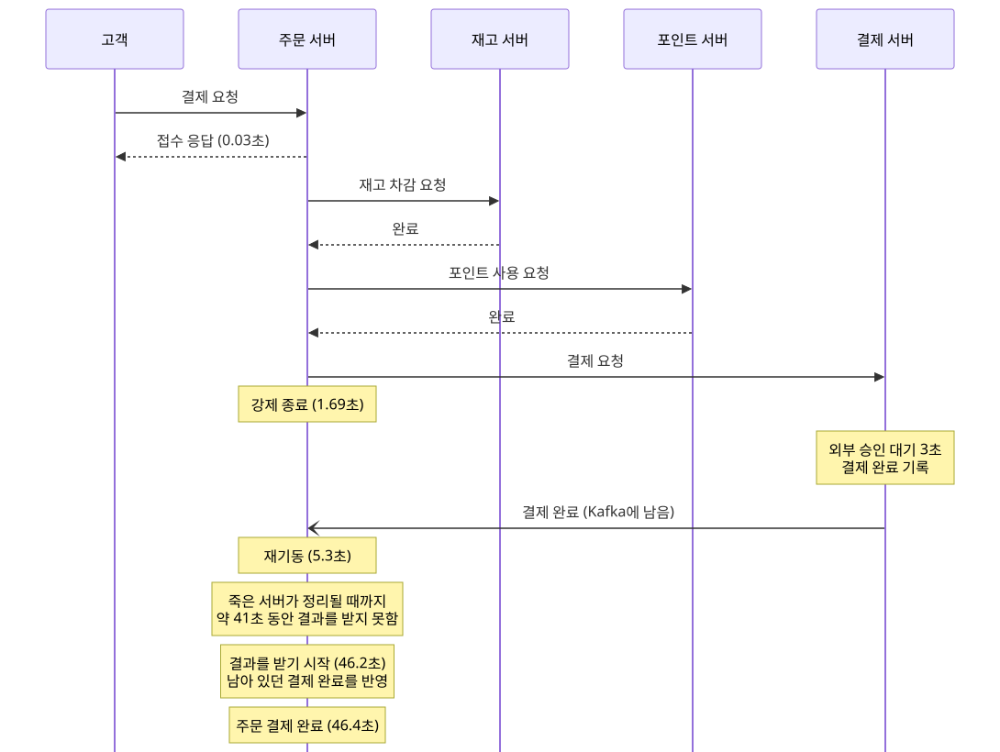

- **Given** 결제 전 주문 하나가 있다.
- **When** 결제 승인을 기다리는 사이 주문 서버를 강제로 종료하고 곧바로 다시 띄우면
- **Then** 고객은 이미 접수 응답을 받은 뒤라 영향이 없고, 결제를 취소하지 않는다.
- **Then** 주문 서버가 남아 있던 결제 결과를 이어 받아 완료하고, 결제는 한 번이다.

### S7 포인트 DB에 2분 동안 접속할 수 없을 때

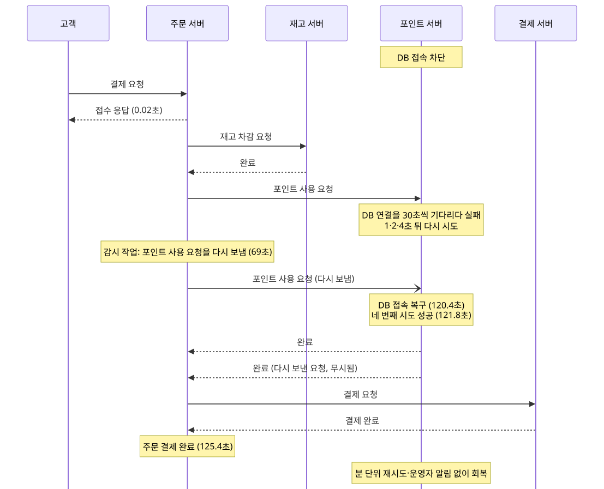

- **Given** 포인트 서버가 DB에 접속하지 못하게 막았다.
- **When** 주문을 결제하고 120초 뒤 막은 것을 풀면
- **Then** 장애 중 조회는 "결제 처리 중"이고, 결제를 취소하지 않는다.
- **Then** 결제를 마저 완료하고 재고·포인트·결제가 한 번씩이며, 운영자 알림은 없다.

### S8 메시지 발송기가 죽어 있을 때

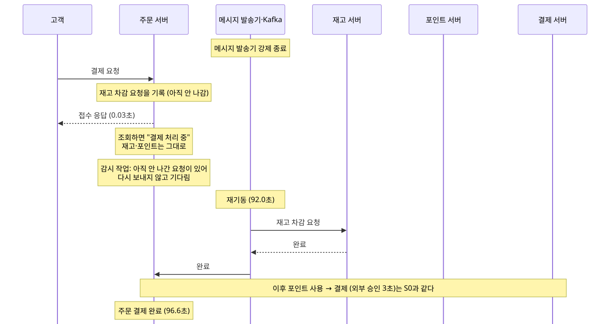

- **Given** 메시지 발송기를 강제로 종료했다.
- **When** 주문을 결제하고 90초 뒤 다시 띄우면
- **Then** 장애 중 요청은 DB에 남아 있고, 감시 작업은 중복 요청을 보내지 않고 기다린다.
- **Then** 발송기가 돌아오면 결제를 마저 완료하고, 재고·포인트·결제가 한 번씩이다.

### S9 처리할 수 없는 잘못된 메시지가 들어올 때

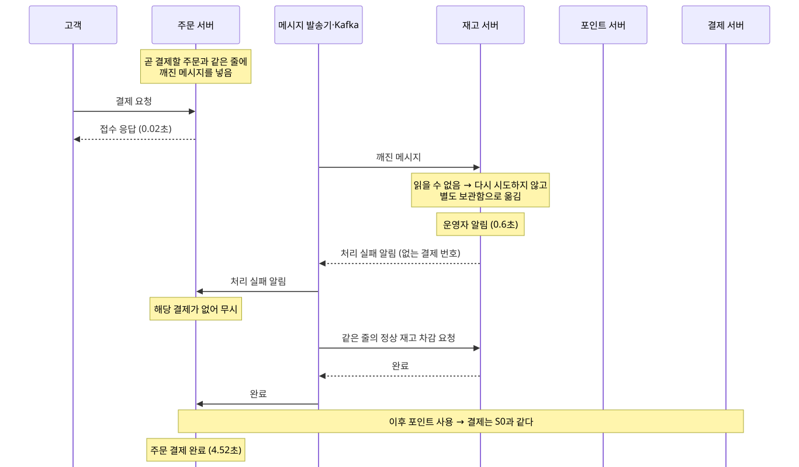

- **Given** 곧 결제할 주문과 같은 줄 (같은 파티션)에 깨진 메시지를 넣었다.
- **When** 그 주문을 결제하면
- **Then** 깨진 메시지는 다시 시도하지 않고 별도 보관함 (DLT)으로 빠지며, 운영자 알림이 1건 나간다.
- **Then** 정상 주문은 기다리지 않고 6초 안에 완료된다.

### S10 이미 처리한 메시지를 다시 받을 때

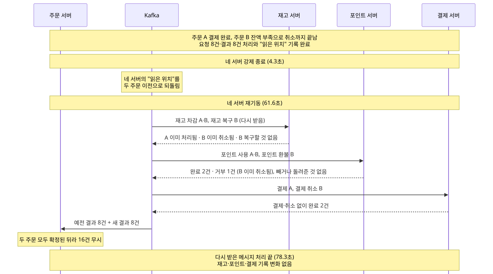

- **Given** 주문 A는 결제 완료, 주문 B는 잔액 부족으로 취소 처리까지 끝났다.
- **When** 네 서버를 강제로 종료하고, 두 주문 이전 위치부터 메시지를 다시 읽게 한 뒤 다시 띄우면
- **Then** 요청 8건과 결과 8건을 다시 받지만 재고·포인트·결제 기록이 전혀 바뀌지 않는다.
- **Then** 두 주문의 상태가 그대로이고, 운영자 알림이 없다.

### S11 결제가 들어오는 중에 메시지 서버 한 대가 죽을 때

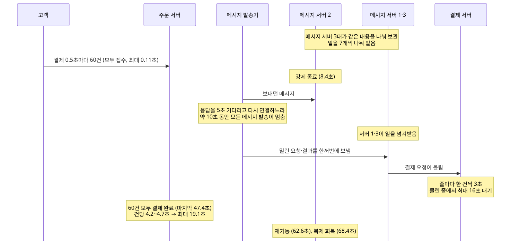

- **Given** 레포의 compose (메시지 서버 1대)와 따로 메시지 서버 3대, 복제 3인 클러스터를 띄웠다. B-21 이전 구성 (결제 요청 12줄, 원본 토픽 21줄)이라 서버마다 원본 7줄씩 맡는다.
- **When** 결제를 0.5초마다 60건 넣는 도중, 그중 한 대를 강제로 종료하면
- **Then** 모든 결제 요청이 접수되고, 60건 모두 취소 없이 결제 완료된다.
- **Then** 운영자 알림과 발송 실패가 0건이다.

### S12 결제 승인을 기다리는 동안 취소가 먼저 끝날 때

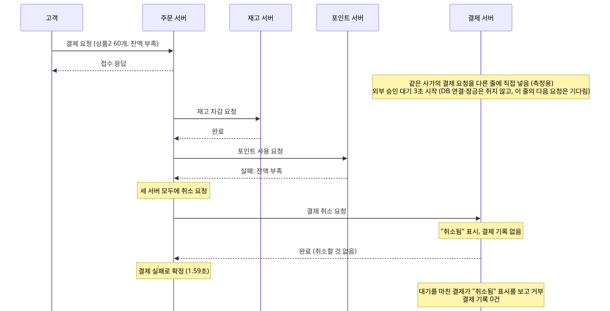

- **Given** 잔액 부족으로 취소될 주문에, 같은 사가의 결제 요청을 다른 줄에 들어가는 키로 직접 넣어 외부 승인 대기를 시작하게 했다. 지금 코드에는 취소가 시작된 사가의 결제 요청이 다른 줄에 남는 정상 경로가 없다. 결제와 취소가 다른 줄에서 처리되더라도 "취소됨" 표시가 결제를 막는지 보려고 만든 모양이다.
- **When** 대기 중에 주문 서버의 취소 요청이 먼저 처리되면
- **Then** 주문은 결제 실패로 확정되고, 대기를 마친 결제는 거부돼 결제 기록이 0건이다.

### 부하 측정 결제 요청이 초당 10건씩 몰릴 때

- **Given** 재고와 잔액을 넉넉히 채웠다.
- **When** 결제 요청을 초당 4건씩 30초, 이어서 초당 10건씩 60초 넣으면
- **Then** 모든 요청이 접수되고, 720건 모두 재고·포인트·결제가 정확히 한 번씩이다.
- **Then** 결제가 밀리지 않고, 마지막 요청 뒤 약 11초 안에 모두 끝난다.
