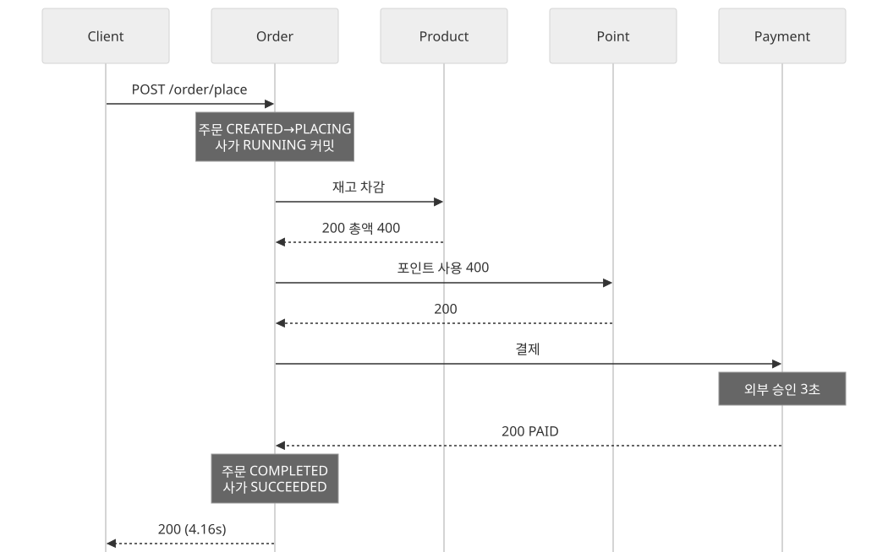
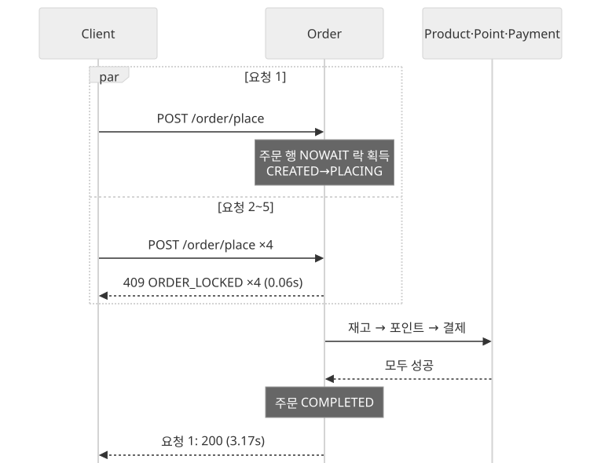
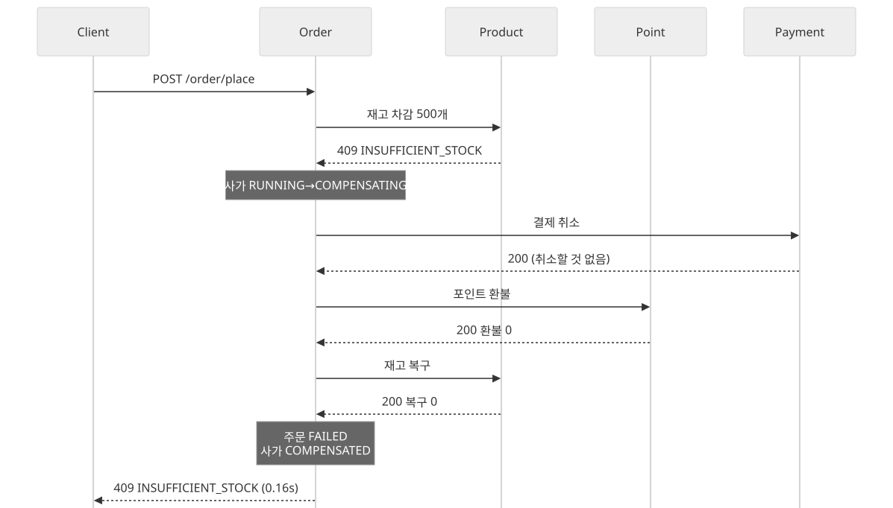
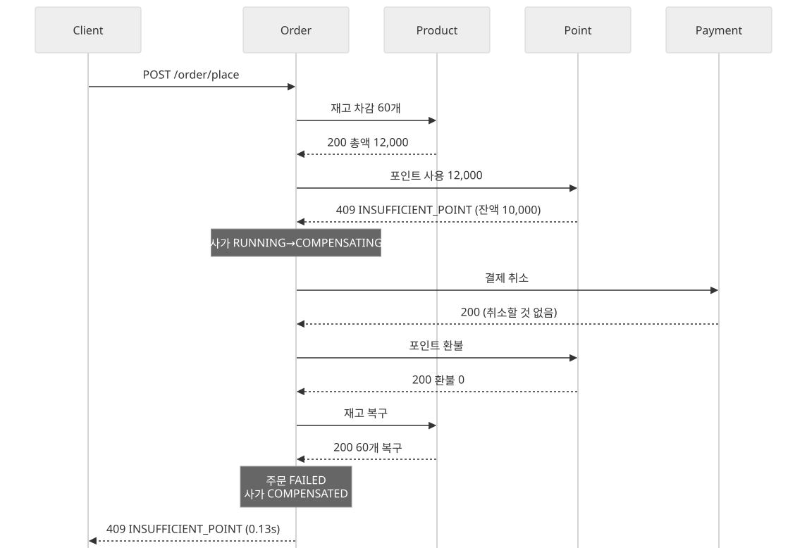
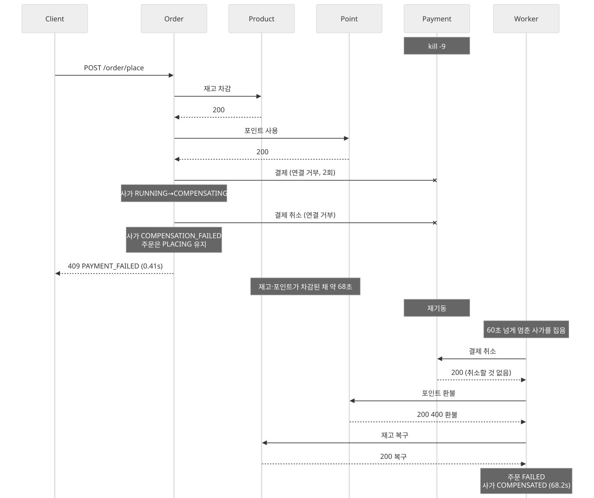
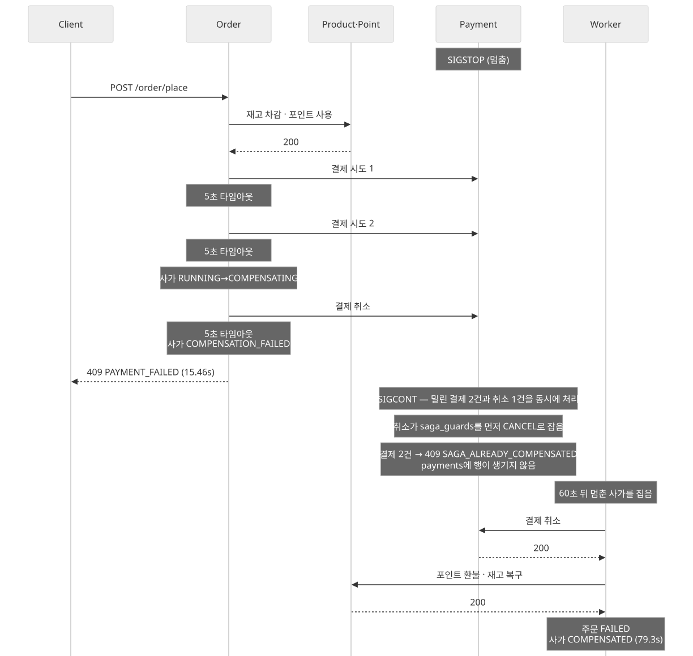
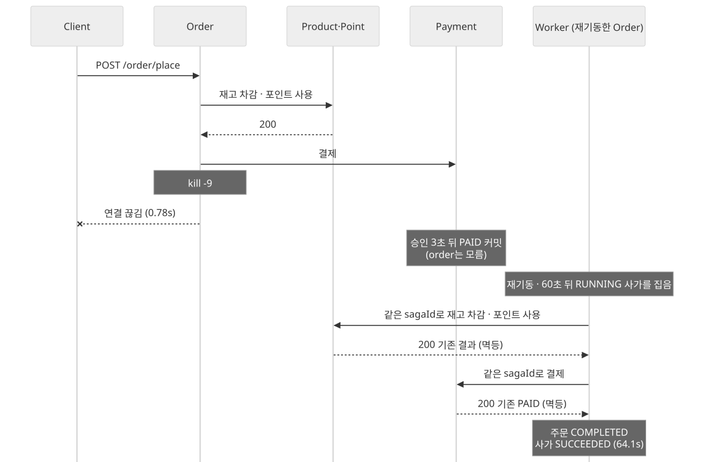
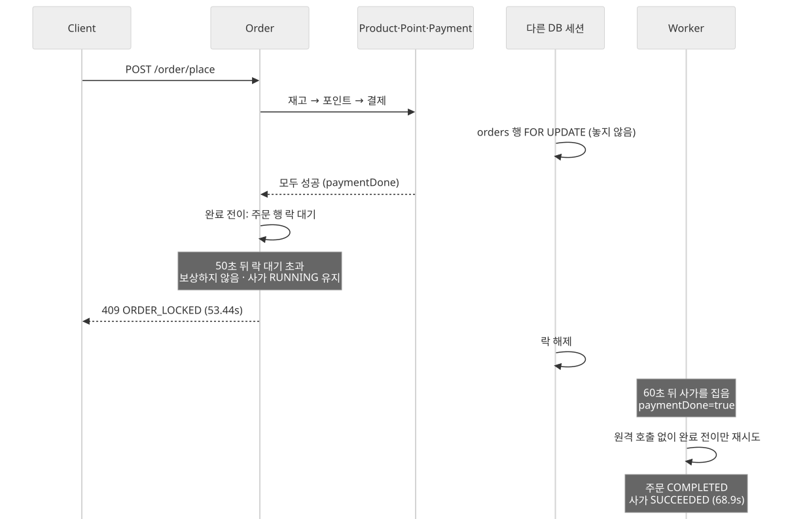

# 사가 오케스트레이션 KPI 리포트

- **측정일**: 2026-09-24
- **대상**: 주문 결제 (`POST /order/place`) — order가 지휘하는 사가 (Orchestration, 동기 HTTP)
- **질문**: 결제 도중 무엇이 깨져도, 사후 처리가 끝나면 원장이 정확히 맞는가

## 한눈에 보기

- 장애 8가지를 실제 프로세스에 주입했고, 판정 43개 (시나리오 34개, 전역 불변식 9개)가 모두 통과했다.
- 어떤 경우에도 이중 차감·이중 결제가 없었고, 끝난 뒤 멈춘 사가나 `PLACING`에 걸린 주문이 0건이었다.
- 비즈니스 실패의 롤백은 0.2초 안에 끝났다.
- 인프라 장애의 롤백과 전진 복구는 워커가 맡아 64~79초에 끝났다. 이 시간은 코드가 아니라 복구 정책 (임계 60초 + 스윕 10초)이 정한다.
- 발견 1건: 완료 전이가 락 대기로 실패하면 클라이언트는 실패 응답 (`409 ORDER_LOCKED`)을 받지만 주문은 나중에 완료된다.

| 구분          | 시나리오                                                       | 주입한 장애             | 응답             | 최종 정합까지 | 중간 상태 노출 |
|---------------|----------------------------------------------------------------|-------------------------|------------------|---------------|----------------|
| 해피          | [S0](#s0-장애가-없을-때)                                       | 없음                    | 4.16s            | 4.22s         | 3.71s          |
| 해피          | [S7](#s7-같은-주문에-결제-요청-5건이-동시에-올-때)             | 같은 주문 동시 결제 5건 | 3.17s            | 3.31s         | 3.10s          |
| 비즈니스 롤백 | [S1](#s1-재고보다-많이-주문했을-때)                            | 재고 부족               | 0.16s            | 0.18s         | 0s             |
| 비즈니스 롤백 | [S2](#s2-잔액보다-비싼-주문일-때)                              | 잔액 부족               | 0.13s            | 0.18s         | 0s             |
| 인프라 롤백   | [S3](#s3-payment-프로세스가-죽어-있을-때)                      | payment `kill -9`       | 0.41s            | 68.2s         | 68.0s          |
| 인프라 롤백   | [S4](#s4-payment가-응답하지-않을-때)                           | payment `SIGSTOP`       | 15.46s           | 79.3s         | 79.1s          |
| 전진 복구     | [S5](#s5-결제-승인을-기다리는-중에-order가-죽을-때)            | order `kill -9`         | 연결 끊김(0.78s) | 64.1s         | 63.9s          |
| 전진 복구     | [S6](#s6-세-단계가-끝난-뒤-다른-세션이-주문-행을-잡고-있을-때) | 주문 행 락 점유         | 53.44s           | 68.9s         | 68.7s          |

- **응답**: 사가를 실제로 진행한 요청이 응답을 받기까지 걸린 시간
- **최종 정합까지**: 첫 결제 요청부터 사가와 주문이 종결 상태에 닿아 다시 벗어나지 않기까지의 시간
- **중간 상태 노출**: 사가가 끝나지 않은 채 재고·포인트·결제 중 하나라도 반영돼 보이던 시간. 사가 방식에서는 0이 될 수 없다

## 배경: 정상 흐름과 실패 처리

![사가 오케스트레이션 아키텍처와 장애 주입 지점. Client가 order 서버의 OrderController로 결제를 요청하면 SagaOrchestrator가 product의 재고 차감(1초×3회), point의 포인트 사용(1초×3회), payment의 결제(5초×2회)를 차례로 부르고 실패하면 결제 취소, 포인트 환불, 재고 복구 순으로 보상한다. OrderSagaStateService가 단계마다 order 스키마의 orders와 order_saga에 커밋하고, CompensationWorker가 10초마다 60초 넘게 멈춘 사가를 SKIP LOCKED로 집어 재실행하거나 보상한다. 참여자는 각자 이력과 saga_guards를 갖는다. 장애 주입 지점은 S7 동시 요청 5건(Client), S5 order kill -9, S6 orders 행 FOR UPDATE 점유, S1 재고 부족(product), S2 잔액 부족(point), S3 payment kill -9와 S4 payment SIGSTOP(payment)이다](architecture/동기-사가-오케스트레이션-아키텍처.svg)

order는 재고 차감 → 포인트 사용 → 결제를 차례로 부르고, 단계마다 진행 상태를 `order_saga`에 커밋한다. 한 단계가 실패하면 결제 취소 → 포인트 환불 → 재고 복구 순으로 **세 곳 모두에**
보상을 보낸다. 참여자는 `sagaId`로 멱등을 판정하므로, 한 적 없는 단계의 보상은 0을 돌려준다. 보상마저 실패하면 사가를 `COMPENSATION_FAILED`로 남기고,
`CompensationWorker`가 10초마다 60초 넘게 멈춘 사가를 집어 끝낸다. 결제까지 성공한 사가는 완료 전이가 실패해도 되돌리지 않고 앞으로 끝낸다.

원격 호출 정책은 재고·포인트가 1초 타임아웃에 3회, 결제가 5초 타임아웃에 2회 (백오프 300ms)다. 보상은 요청 안에서 1회, 워커에서 3회 시도한다. 결제에는 외부 승인 지연 3초가 들어 있다.

## 시나리오

다이어그램의 참여자는 Client(호출자), Order(오케스트레이터), Product·Point·Payment(참여자), Worker(order 안의 `CompensationWorker`)다.
(order 안의 `CompensationWorker`)다.

### S0 장애가 없을 때

나머지 시나리오와 비교하는 기준선이다.

- **Given** 사용자 1이 상품1 2개와 상품2 1개 (400원)를 주문했다.
- **When** 주문을 결제하면
- **Then** 200으로 응답한다.
- **Then** 사가는 `SUCCEEDED`, 주문은 `COMPLETED`다.
- **Then** 재고·포인트가 주문만큼 한 번 차감되고 `PAID` 결제가 1건이다.
- **Then** 응답이 6초 안에 온다.

측정: 응답 4.16s · 최종 정합 4.22s · 재시도 0 · 보상 0

### S7 같은 주문에 결제 요청 5건이 동시에 올 때

사용자의 연타나 클라이언트 재시도에도 한 번만 결제되는가를 본다.

- **Given** 결제 전 주문 하나가 있다.
- **When** 다섯 요청이 한꺼번에 결제를 시작하면
- **Then** 정확히 1건만 200이다.
- **Then** 나머지는 `409 ORDER_LOCKED`(진입 락 경합) 또는 `409 INVALID_ORDER_STATE_TRANSITION`(이미 `PLACING`)이다.
- **Then** 사가는 하나이고 재고·포인트·결제가 한 번만 반영된다.

측정: 409 네 건이 모두 `ORDER_LOCKED`였다. 다섯 요청의 진입이 수 ms 안에 겹쳐 주문 행 락에서 걸렸기 때문이다.

### S1 재고보다 많이 주문했을 때

첫 단계에서 실패하면 되돌릴 것이 없지만, 보상은 그래도 세 곳에 모두 나간다.

- **Given** 재고 100개인 상품1을 500개 주문했다.
- **When** 주문을 결제하면
- **Then** `409 INSUFFICIENT_STOCK`을 받는다.
- **Then** 사가는 `COMPENSATED`, 주문은 `FAILED`다.
- **Then** 재고·포인트 순차감 0, `PAID` 결제가 없다.
- **Then** 최종 정합까지 2초 이내다.

측정: 최종 정합 0.18s · 보상 1회 · 참여자 셋 모두 `saga_guards`에 `CANCEL`이 남았다.

### S2 잔액보다 비싼 주문일 때

앞 단계가 이미 반영된 뒤 실패하면 보상이 그것을 실제로 되돌려야 한다.

- **Given** 잔액 10,000원인 사용자 2가 상품2 60개 (12,000원)를 주문했다.
- **When** 주문을 결제하면
- **Then** `409 INSUFFICIENT_POINT`를 받는다.
- **Then** 사가는 `COMPENSATED`, 주문은 `FAILED`다.
- **Then** 먼저 차감된 재고 60개가 복구되어 순차감 0이고, `PAID` 결제가 없다.
- **Then** 최종 정합까지 2초 이내다.

측정: 최종 정합 0.18s · 재고가 차감돼 보인 시간은 폴링 간격 (150ms)보다 짧아 잡히지 않았다.

### S3 payment 프로세스가 죽어 있을 때

동기 보상이 같은 장애에 걸리면 워커가 끝내야 한다.

- **Given** payment를 `kill -9`로 죽였다.
- **When** 주문을 결제하면
- **Then** 연결 거부로 재시도를 소진해 `409 PAYMENT_FAILED`를 받는다.
- **Then** 보상 첫 단계인 결제 취소도 실패해 사가는 `COMPENSATION_FAILED`, 주문은 `PLACING`에 머문다.
- **Then** 그동안 재고·포인트는 차감된 채 보인다.
- **When** payment를 다시 띄우면
- **Then** 워커가 보상을 끝내 주문은 `FAILED`다.
- **Then** 재고·포인트 순차감 0, `PAID` 결제가 없다.
- **Then** 최종 정합까지 "첫 응답 + 워커 임계 60초 + 스윕 10초 + 여유 10초" 이내다.

측정: 최종 정합 68.2s · 재시도 3 (결제 2, 결제 취소 1) · 보상 2회 (요청 안 1, 워커 1)

### S4 payment가 응답하지 않을 때

order가 포기한 결제가 payment 안에서 늦게 커밋되는 경합을 본다. 연결은 되지만 응답이 없어서, 요청이 payment 소켓에 쌓였다가 풀리는 순간 한꺼번에 처리된다.

- **Given** payment를 `SIGSTOP`으로 얼렸다.
- **When** 주문을 결제하면
- **Then** 5초 타임아웃 2회로 재시도를 소진해 `409 PAYMENT_FAILED`를 받는다.
- **Then** 결제 취소도 타임아웃이라 사가는 `COMPENSATION_FAILED`다.
- **When** payment를 풀어 밀린 결제 2건과 취소 1건이 한꺼번에 처리되고 워커가 돌면
- **Then** 늦게 도착한 결제가 살아남지 않고 재고·포인트 순차감 0이다.
- **Then** 주문은 `FAILED`다.
- **Then** 최종 정합까지 "첫 응답 + 60초 + 10초 + 10초" 이내다.

측정: 응답 15.46s (5초 × 3회 + 백오프) · 최종 정합 79.3s · payment의 `saga_guards`는 `CANCEL`, `payments` 행 없음

`saga_guards`는 참여자마다 `sagaId` 하나에 한 행을 두고, 정방향과 보상 중 먼저 커밋한 쪽의 종류를 남긴다. 보상이 먼저 잡은 사가의 정방향은 거부되므로, order가 타임아웃으로 포기한 결제가
뒤늦게 살아나 돈이 빠지는 일이 없다.

### S5 결제 승인을 기다리는 중에 order가 죽을 때

오케스트레이터가 사라져도 사가는 앞으로 끝나야 한다.

- **Given** 결제 전 주문 하나가 있다.
- **When** 포인트 차감 직후, payment가 승인을 기다리는 사이 order를 `kill -9`하면
- **Then** 클라이언트는 응답을 받지 못한다.
- **When** order를 다시 띄우면
- **Then** 워커가 같은 `sagaId`로 정방향을 처음부터 다시 실행해 주문은 `COMPLETED`다.
- **Then** 재고·포인트·결제가 정확히 한 번만 반영된다.
- **Then** 최종 정합까지 "첫 응답 + 60초 + 10초 + 10초" 이내다.

측정: 최종 정합 64.1s · 재고 이력 2행 (상품 2개) · 포인트 이력 1행 · `PAID` 1건

### S6 세 단계가 끝난 뒤 다른 세션이 주문 행을 잡고 있을 때

결제까지 성공한 사가는 완료 전이가 실패해도 되돌리지 않는다.

- **Given** MySQL `innodb_lock_wait_timeout`이 "워커 임계 − 외부 승인 3초"보다 짧다 (측정 때 50초).
- **When** 포인트 차감 직후 다른 세션이 주문 행을 `FOR UPDATE`로 잡아, 완료 전이가 락 대기 끝에 실패하면
- **Then** 보상하지 않고 사가를 `RUNNING`(`paymentDone=true`)으로 남긴다.
- **Then** 재고·포인트·결제는 확정된 채 그대로다.
- **When** 락이 풀리고 워커가 돌면
- **Then** 원격을 다시 부르지 않고 주문을 `COMPLETED`로 닫는다.
- **Then** 최종 정합까지 "첫 응답 + 60초 + 10초 + 10초" 이내다.

측정: 최종 정합 68.9s · 워커 로그 `Saga completed without replay` · 거래 이력과 결제는 한 번씩

## 발견 사항

- **비즈니스 실패의 롤백은 0.2초 안에 끝난다.** 보상이 같은 요청 안에서 동기로 돌고, 참여자가 모두 살아 있기 때문이다.
- **인프라 장애의 롤백은 60초대가 하한이다.** 동기 보상 1회가 같은 장애에 걸리면 사가는 `COMPENSATION_FAILED`로 남고, 재고·포인트가 차감된 채 워커 임계 60초와 스윕 최대 10초를
  기다린다. 이 창을 줄이려면 코드가 아니라 복구 정책을 바꿔야 한다.
- **늦게 도착한 결제는 가드가 막았다.** S4에서 payment가 풀리자 취소가 `saga_guards`를 먼저 `CANCEL`로 잡았고, 밀려 있던 결제 2건은
  `409 SAGA_ALREADY_COMPENSATED`로 끝나 `payments`에 행을 남기지 않았다.
- **전진 복구는 이중 차감·이중 결제 없이 끝났다.** S5는 같은 `sagaId` 재실행으로, S6은 원격 호출 없이 완료 전이만 다시 시도해서 완료했다.
- **S6의 클라이언트 응답이 사실과 다르다.** 완료 전이가 락 대기 50초 끝에 실패하면 클라이언트는 `409 ORDER_LOCKED`("잠겨 있으니 다시 시도하라")를 받는다. 그러나 주문은 약 15초 뒤
  워커가 `COMPLETED`로 닫는다. 원장은 맞지만 응답은 실패처럼 보인다. 이 응답을 바꿀지는 아직 정하지 않았다.

## 측정 방법

- 네 서비스의 부트 jar를 자식 프로세스로 띄우고, 시작할 때 네 스키마를 `ddl-auto: create`로 초기화했다.
- 장애는 전부 프로세스 밖에서 넣었다. 서비스 코드에 장애 훅이 없으므로 측정한 코드가 곧 운영하는 코드다.

| 수단                                    | 흉내 내는 상황                                                       | 시나리오               |
|-----------------------------------------|----------------------------------------------------------------------|------------------------|
| 주문 수량·금액                          | 비즈니스 규칙 위반(재고 부족, 잔액 부족)                             | S1, S2                 |
| `kill -9`                               | 프로세스 즉사. 연결 거부가 난다                                      | S3(payment), S5(order) |
| `SIGSTOP` → `SIGCONT`                   | 연결은 되지만 응답이 없는 멈춤. 풀리면 밀린 요청이 한꺼번에 처리된다 | S4(payment)            |
| 별도 MySQL 세션의 `SELECT … FOR UPDATE` | 다른 트랜잭션이 주문 행을 오래 잡고 있음                             | S6                     |
| 같은 주문에 동시 요청 5건               | 사용자의 연타, 클라이언트 재시도                                     | S7                     |

- 죽인 앱은 `ddl-auto=update`로 다시 띄워 워커가 복구할 사가가 스키마째 사라지지 않게 했다.
- 시나리오를 Kotest `BehaviorSpec`의 Given·When·Then으로 적어 순서대로 돌렸다. 위 시나리오 절의 Given·When·Then이 그 판정 문구 그대로다.
- 원장은 root 계정으로 네 스키마를 150ms마다 읽었다. 로그가 아니라 원장을 판정 근거로 삼았다.
- 각 시나리오는 시작할 때 비종결 사가가 0건인지 먼저 확인했다. 앞 시나리오가 남긴 사가를 워커가 스윕하면 그 활동이 다음 시나리오의 수치에 섞이기 때문이다.
- KPI 목표 시간은 order의 `SagaRecoveryPolicy`(임계 60초, 스윕 10초)에서 계산했다.
- 측정 코드는 레포에 두지 않았다. 네 앱을 띄워야만 도는 코드는 모듈 테스트로 두면 평소 늘 건너뛰게 되고, 이 기록은 설계를 한 시점에 검증한 결과로 남긴다.

### 원장 불변식

- 되돌린 사가는 재고 이력의 순차감이 0, 포인트 이력의 순사용이 0이고 `PAID` 결제가 없다.
- 완료한 사가는 재고·포인트가 주문만큼 정확히 한 번 빠지고 `PAID` 결제가 1건이며, 거래 이력에 중복 행이 없다.
- 전부 끝난 뒤에는 상품마다 "시드 − 이력 순차감 = 현재 재고", 사용자마다 "시드 − 이력 순사용 = 현재 잔액"이 맞고, `COMPLETED` 주문과 `PAID` 결제가 1:1이며, 비종결 사가와
  `PLACING` 주문이 0건이다.

### 그 밖의 지표

| 지표        | 정의                                        |
|-------------|---------------------------------------------|
| 원격 재시도 | order 로그의 `Remote call failed` 줄 수     |
| 보상 시도   | 사가가 `COMPENSATING`으로 들어간 횟수       |
| 워커 개입   | 이 사가의 id가 찍힌 워커 복구 로그가 있는가 |

## 한계

- 폴링 간격이 150ms라 구간 길이에는 ±0.15초 오차가 있다. S1·S2의 사가 경로에서 `COMPENSATING`이 관측되지 않은 것도 그 상태가 폴링 간격보다 짧게 지나갔기 때문이다.
- 원격 재시도 수는 로그 줄로 셌다. 그 줄에는 사가 id가 없어서 시간 창으로 귀속했고, 시작 전 비종결 사가 0건 확인으로 다른 사가가 섞이지 않게 했다.
- MySQL 한 대, 앱 인스턴스 하나씩인 로컬 환경의 수치다. 네트워크 지연과 다중 인스턴스 워커 경합은 재지 않았다.
- 한 시점의 기록이다. 사가·워커·참여자 코드나 `SagaRecoveryPolicy`를 고치면 이 수치는 더 이상 현재 코드를 대변하지 않는다.
